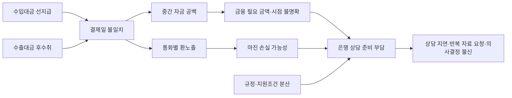
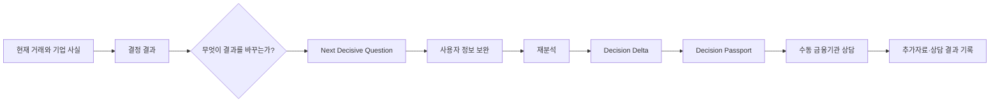
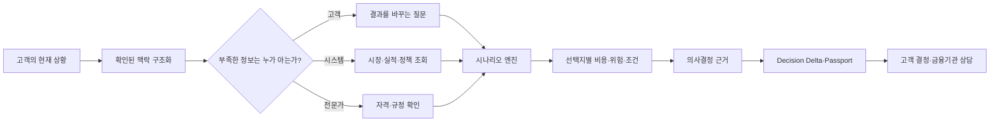
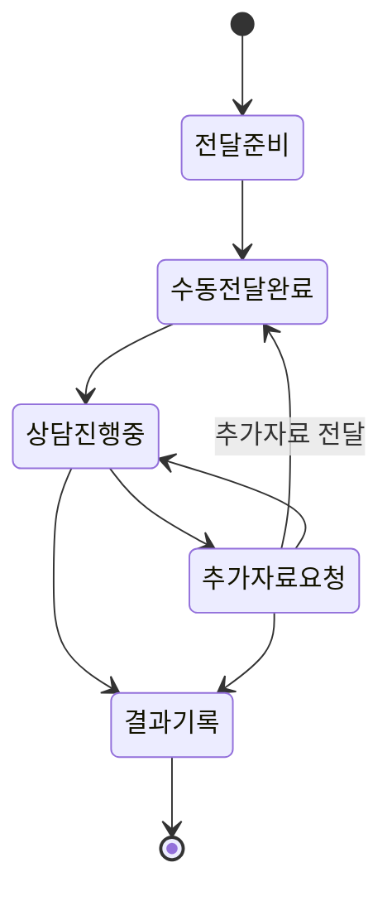
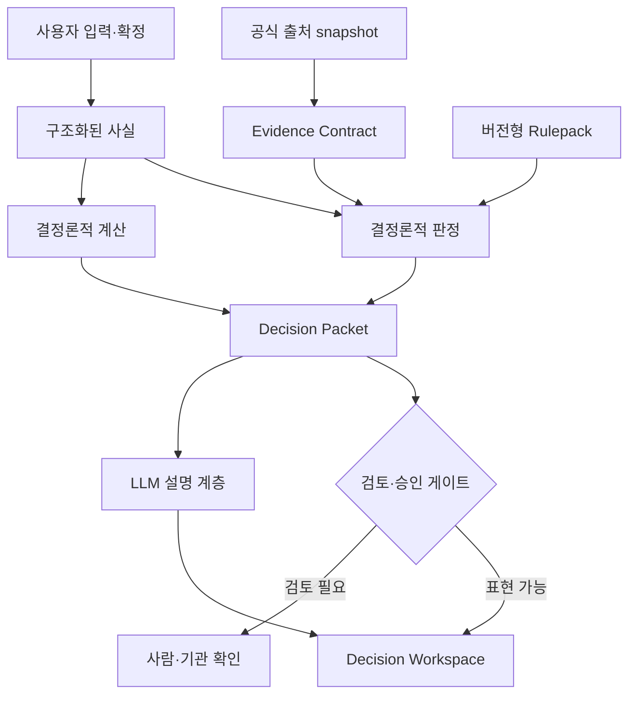
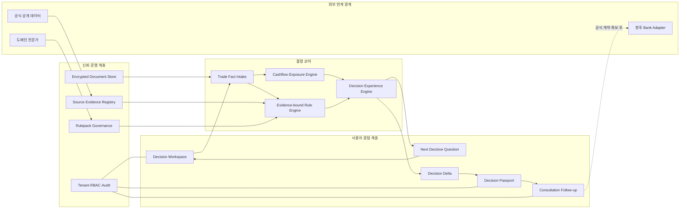
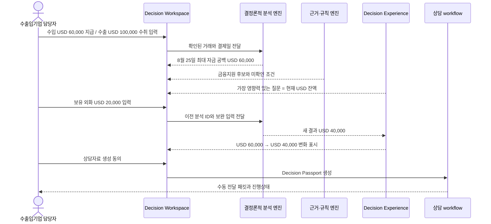
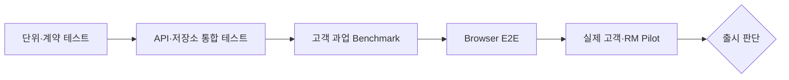
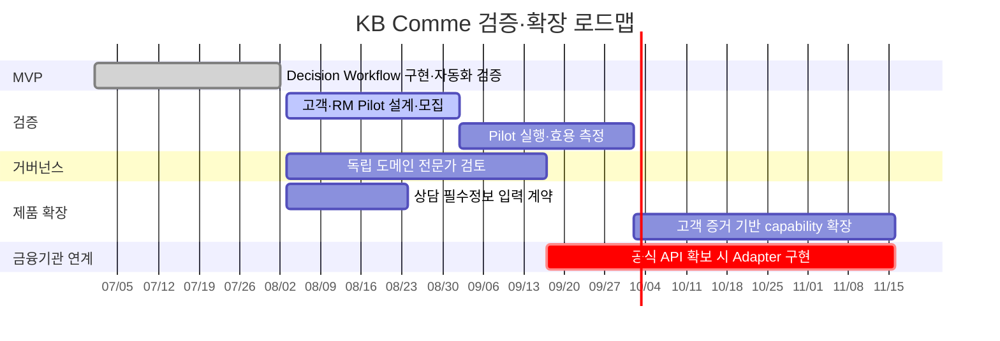

# KB Comme 대회 제출 기획안

## 계약조건을 현금흐름과 위험 시나리오로 변환하고, 실행 가능한 금융조치까지 연결하는 Trade Deal Decision Twin

| 항목 | 내용 |
|---|---|
| 대회명 | [작성 필요: 대회 공식 명칭] |
| 출품 분야 | AI 에이전트 / 금융·수출입 업무 혁신 |
| 서비스명 | KB Comme |
| 팀명·참가자 | [작성 필요] |
| 작성 기준일 | 2026-08-02 |
| 현재 단계 | 작동 가능한 MVP 및 자동화 검증 완료, 실제 고객·RM 파일럿 전 |

---

## 초록

수출입 중소·중견기업은 계약 전체로는 이익이 예상되더라도 수입대금 지급일과 수출대금
회수일이 달라 단기 자금 공백과 환노출을 동시에 겪는다. 그러나 실제 의사결정에 필요한 정보는
계약서, 담당자의 경험, 기업 내부 자료, 시장 데이터, 금융기관과 관계기관에 흩어져 있다. 기존의
계산 도구나 금융상품 추천 서비스는 이 맥락을 충분히 연결하지 않은 채 결과나 상품 목록을
제시하기 때문에, 사용자는 어떤 정보가 부족하고 그 정보가 결론을 어떻게 바꾸는지 알기 어렵다.

KB Comme는 단일 환리스크 계산기가 아니라 `Trade Deal Decision Twin`을 지향한다. 고객의 현재
기업·거래·자금·위험 맥락을 확인된 사실로 구조화하고, 필요한 정보를
`고객에게 확인할 정보`, `시스템에서 조회할 정보`, `전문가가 확인할 정보`로 나눈다. 그 정보를
기반으로 결제일 자금 공백, 환노출, 환율 변화와 헤지 대안 등의 시나리오를 계산하고, 선택지별
비용·위험·조건과 근거를 제공한다. 이어서 결과를 바꾸는 다음 질문(Next Decisive Question),
정보 보완 전후 변화(Decision Delta), 사실·계산·규칙·출처가 결합된 상담자료(Decision
Passport)를 연속적으로 제공한다. 생성형 AI는 맥락을 임의로 추정하거나 금융 결론을 만드는
주체가 아니라, 검증 가능한 엔진이 만든 결과를 설명하는 계층으로 제한한다.
현재 MVP는 고객 과업 benchmark 17/17, 구조화 검증 58/58과 브라우저 E2E 4/4를 통과했다.
본 기획은 AI의 “답”이 아니라 계약조건이 현금흐름과 위험으로 번역되고, 그 변화가 대응 행동으로
이어지는 `Clause-to-Cash-to-Action` 과정을 제품화하는 데 목적이 있다. 현재 MVP는 이 목표의
기반인 거래 맥락, 현금흐름·환노출 계산, 질문·Delta·Passport를 구현했으며, 계약 조항 자동 추출과
지급지연 시나리오 자동 생성, 위험 간 연쇄 전파는 목표 기능으로 구분한다.

**핵심어:** 수출입금융, 자금 공백, 환위험, 결정지원, 설명가능 AI, Evidence, Decision Delta

---

## 1. 서론

### 1.1 연구·기획 배경

수출입기업의 금융 문제는 단순히 환율이 오르거나 내리는 문제가 아니다. 원자재 대금을 먼저
지급하고 완제품 수출대금을 나중에 받는 기업은 최종적으로 외화가 남더라도 중간 결제일에는
현금이 부족할 수 있다. 이때 기업은 다음 질문에 동시에 답해야 한다.

- 언제, 어떤 통화로, 얼마가 부족한가?
- 수출과 수입이 서로 상계되는 금액과 실제 결제일에 사용할 수 있는 금액은 얼마인가?
- 남은 환노출이 기업의 손익 한도를 얼마나 훼손할 수 있는가?
- 어떤 금융·보증·보험 후보를 검토할 수 있으며 무엇이 아직 확인되지 않았는가?
- 은행이나 전문가에게 어떤 사실과 서류를 가져가야 하는가?

전담 외환·무역금융 인력이 부족한 중소·중견기업은 이 문제를 엑셀, 담당자의 경험, 여러 기관의
웹페이지와 은행 상담을 오가며 해결한다. 정보가 흩어져 있을 뿐 아니라 입력 하나가 바뀔 때
결론 전체가 어떻게 달라지는지 추적하기 어렵다.

### 1.2 기획 질문

본 기획은 다음 질문에서 출발한다.

> AI가 고객의 현재 상황을 확인 가능한 맥락으로 구조화하고, 필요한 정보를 수집·보완하여,
> 가능한 시나리오와 선택지별 근거를 제시함으로써 사용자가 실제 결정을 완성하도록 도울 수 있는가?

### 1.3 기획 범위

초기 범위는 반복적인 수출입 거래를 가진 중소·중견 제조기업의 `상담 전 의사결정 준비`다.
금융기관의 실제 대출 승인, 고객별 한도·금리 확정, 보험·보증 접수와 금융상품 판매는 포함하지
않는다. 현재 자동 계산 범위는 USD·T/T 거래이며, 미지원 결제방식은 지원되는 거래로 임의
변환하지 않는다.

---

## 2. 문제 정의

### 2.1 핵심 사용자

초기 핵심 사용자는 해외에서 원자재를 수입하고 가공한 제품을 수출하는 국내 중소·중견
제조기업이다. 이들은 수입과 수출 현금흐름을 함께 보아야 하지만 전담 인력이 부족하고, 은행에
상담하기 전 필요한 자금 규모와 준비자료를 스스로 구조화하기 어렵다.

### 2.2 기존 접근의 단절

| 기존 접근 | 제공하는 것 | 남는 문제 |
|---|---|---|
| 엑셀·수기 계산 | 거래별 입출금 합계 | 만기 불일치, 규칙·근거·변경 이력 연결이 약함 |
| 환위험 분석 도구 | 노출액·시나리오·헤지안 | 금융지원 조건과 상담자료가 분리됨 |
| 금융상품 검색 | 상품 설명과 대상 조건 | 기업의 실제 거래 일정·자금 공백과 연결되지 않음 |
| 범용 생성형 AI | 이해하기 쉬운 설명 | 계산 재현성, 최신 출처, 권한과 승인 경계가 불명확 |
| 은행 상담 | 실제 확인과 다음 절차 | 상담 전에 사실·금액·서류를 다시 정리해야 함 |

### 2.3 문제의 인과 구조



### 2.4 해결해야 할 본질

본질은 더 많은 상품을 추천하는 것이 아니다. 고객의 현재 상황을 `누가 확인한 어떤 사실인지`가
드러나는 맥락으로 만들고, 부족한 정보를 적절한 주체로부터 수집한 뒤, 가능한 대응 시나리오를
같은 기준으로 비교하는 것이다. KB Comme는 결정을 대신 내리기보다 선택지별 결과와 근거,
아직 확인되지 않은 조건과 최종 판단 권한을 제시하여 실제 상담 가능한 상태까지 의사결정을
준비한다.

---

## 3. 전반적인 기획 주제

### 3.1 주제 문장

> **KB Comme — 계약조건 하나의 변화가 자금 공백·환노출·보험·금융조치에 미치는 연쇄 영향을
> 보여주는 거래 단위 수출입금융 의사결정 AI**

### 3.2 한 줄 가치 제안

> 계약서와 거래 사실을 입력하면 조건을 현금흐름으로 변환하고, 결제 지연·조건 변경이
> 자금 공백·환노출·보험 검토·금융기간에 미치는 영향을 비교해 실행 근거로 남긴다.

### 3.3 기획의 차별화 축

환리스크, 서류심사, 뉴스 기반 리스크, 금융상품 연결은 이미 다수 출품작 제목에서 반복되는
경쟁 영역이다. 따라서 KB Comme는 “환위험도 계산한다”거나 “기타 기능도 제공한다”는 기능 수
경쟁을 하지 않는다. 차별화 단위는 기능이 아니라 `거래 조건의 변화가 여러 결정에 전파되는
인과관계`다. 이를 `Trade Deal Decision Twin`, 작동 방식은 `Clause-to-Cash-to-Action`으로 정의한다.

```text
계약 조항·거래 사실 구조화           Clause
+ 지급·수취 이벤트와 자금 원장       Cash
+ 지연·조건 변경의 위험 연쇄 전파    Decision Twin
+ 재협상·보험·금융·부분헤지 비교     Action
+ 변화 근거와 상담자료 보존          Decision Delta · Passport
```

고유한 차이는 다음 네 단계에 있다.

1. **Clause-to-Cash:** 결제조건을 날짜별 지급·수취 이벤트로 변환
2. **Cross-risk propagation:** 지급 지연이 자금 공백 기간, 환노출 기간, 보험·신용 확인과
   금융 필요기간에 미치는 영향을 한 번에 재계산
3. **Decision Delta:** 조건 변경 전후에 실제로 바뀐 금액·기간·상태·필요 행동만 비교
4. **Decision Passport:** 사실·계산·규칙·출처·미확인 조건을 상담자료로 보존



### 3.4 제품의 핵심 작동 원리

KB Comme의 사용자 경험은 `맥락 인식 → 정보 수집 → 시나리오 분석 → 근거 제공`의 네 단계로
정리할 수 있다. 여기서 맥락 인식은 생성형 AI가 고객 상황을 추측한다는 뜻이 아니다. 사용자가
확인한 거래, 문서에서 추출 후 확정한 사실, 공식 데이터와 계산 결과를 출처와 함께 하나의
의사결정 맥락으로 연결한다는 뜻이다.

1. **맥락 인식:** 기업, 거래 방향, 통화, 금액, 결제일, 자금 목적과 위험 허용범위를 구조화한다.
2. **정보 수집:** 부족한 정보를 고객 질문, 시스템 조회, 전문가 확인으로 분리해 보완한다.
3. **시나리오 분석:** 지급·수취 시점, 환율 변화, 보유 외화, 헤지 비율과 금융 조건을 바꿔
   선택지별 현금흐름·손익·조건을 계산한다.
4. **근거 제공:** 어떤 사실과 계산식·규칙·출처가 결과를 만들었는지, 무엇이 아직 미확정인지와
   누가 최종 확인해야 하는지를 함께 제시한다.



---

## 4. 기획 의도

### 4.1 사용자 관점

사용자가 분석 결과를 수동적으로 읽는 데서 끝나지 않고, 서비스가 자신의 상황을 어떻게
이해했는지 먼저 확인하게 한다. 이어서 현재 결론이 왜 나왔는지, 어떤 정보를 보완하면 가능한
선택지가 어떻게 달라지는지를 이해하도록 한다. 최종적으로는 금융기관에 가기 전에 필요 자금,
환노출, 시나리오별 대응, 후보 제도, 준비자료와 확인 질문을 하나의 흐름으로 정리하게 한다.

### 4.2 금융기관·전문가 관점

상담 담당자가 AI의 자연어 문장을 그대로 신뢰하도록 요구하지 않는다. 사용자가 확인한 사실,
결정론적 계산, 적용 규칙, 공식 출처, 버전과 미확인 조건을 검토할 수 있는 패킷을 제공하여 상담
초기의 반복 확인 비용을 줄인다.

### 4.3 기술 관점

생성형 AI가 금액·자격·규정 결론을 직접 만들어 발생하는 환각과 재현성 문제를 줄인다. LLM은
구조화된 결과를 설명하는 표현 계층에 두고, 핵심 계산과 판정은 버전이 있는 코드·규칙·근거
엔진이 담당한다.

### 4.4 거버넌스 관점

미확인 사실, 만료된 출처와 독립 전문가 승인을 받지 않은 규칙을 확정 판정으로 승격하지 않는다.
KB 데이터나 API가 없는 현재는 자동 접수 대신 금융기관 중립 수동 패킷만 제공한다. 즉,
“할 수 있는 것”뿐 아니라 “누가 최종 확인해야 하는가”를 서비스 결과의 일부로 설계한다.

---

## 5. 필수 모듈 도출

기획 의도를 실제 사용자 경험으로 만들기 위해서는 다음 모듈이 모두 필요하다. 하나라도 빠지면
결과를 계산하더라도 결정의 변화나 상담 인계까지 완성할 수 없다.

| 모듈 | 해결하는 질문 | 핵심 입력 | 핵심 출력 | 기획 의도와의 연결 |
|---|---|---|---|---|
| M1 Context·Trade Fact Intake | 고객의 현재 상황과 실제 거래는 무엇인가? | 자연어·문서·구조화 거래·기업 사실 | 출처가 구분된 고객·거래 맥락과 누락정보 | 잘못 이해한 맥락으로 정상 결과를 만들지 않음 |
| M2 Cashflow·Scenario Engine | 어떤 조건에서 얼마가 부족하고 손익이 달라지는가? | 방향·통화·금액·결제일·잔액·환율·헤지 조건 | 자금 공백·순노출·자연헤지·만기상계·시나리오 손익 | 선택지 비교의 수치적 토대 |
| M3 Evidence-bound Rule Engine | 어떤 후보이며 무엇이 미확인인가? | 기업·거래 사실, 규칙, 공식 출처 | 후보 상태·이유·필요서류·검토권한 | 추천이 아닌 근거 기반 후보 제시 |
| M4 Next Decisive Question | 다음에 무엇을 물어야 하는가? | 현재 결과와 누락 필드 | 영향도가 가장 큰 질문 | 결과 변경 가능성을 사용자 행동으로 전환 |
| M5 Decision Delta | 답변으로 무엇이 달라졌는가? | 이전·현재 결정 패킷 | 계산·판정·행동의 전후 차이 | 전체 결과 반복 대신 변화 증명 |
| M6 Decision Passport | 상담에 무엇을 가져갈 것인가? | 사실·계산·규칙·출처·Delta | 재현 가능한 상담 패킷 | AI 결과를 실제 업무 산출물로 전환 |
| M7 Consultation Follow-up | 전달 후 어떻게 이어지는가? | 패킷·사용자 기록 | 전달·상담·추가자료·결과 이력 | 다운로드 이후 업무 단절 해소 |
| M8 Governance·Security | 무엇을 믿고 누가 볼 수 있는가? | tenant·역할·승인·버전 | 격리·감사·검토 상태 | 금융 의사결정의 안전 경계 |

---

## 6. 필수 모듈 구현 아이디어

### 6.1 M1 — 고객 맥락과 복합 거래를 “부분 성공”으로 처리하지 않는 Intake

한 문장에 수입과 수출이 함께 있을 때 일부 거래만 추출한 결과는 완전 실패보다 위험하다.
사용자는 모든 거래가 반영됐다고 오해할 수 있기 때문이다. 따라서 둘 이상의 거래 징후가
발견되면 곧바로 분석하지 않고 거래별 방향·금액·결제일을 후보로 보여준 뒤 확인받는다.

**사용 아이디어:** 불확실한 자동완성보다 `fail-closed confirmation`을 우선한다.

### 6.2 M2 — 결제일·환율·헤지 조건을 비교하는 Scenario Engine

통화 `c`, 시점 `t`의 예상 잔액을 다음과 같이 계산한다.

```text
B_c(t) = 기초 외화잔액
       + t까지의 수출대금 수취 합계
       - t까지의 수입대금 지급 합계

FundingGap_c = max(0, -min_t B_c(t))
```

경제적 자연헤지는 전체 수출·수입 금액의 상계 가능분이고, 만기상계는 실제 결제 시점에 사용할
수 있는 금액이다. 두 값을 분리하여 “전체로는 흑자지만 지급일에는 부족”한 상황을 표현한다.

**사용 아이디어:** 총액 차감이 아니라 날짜순 event ledger를 계산한다.

### 6.3 M3 — 규칙과 공식 출처를 함께 묶는 Evidence Contract

각 판정은 `규칙 ID`, `사용한 사실`, `공식 출처`, `관측·수집 시점`, `버전`, `검토 상태`를
함께 가진다. 사실이 없으면 `False`로 추정하지 않고 `insufficient_information`, 공식 확인이
필요하면 `expert_confirmation_required`로 남긴다.

**사용 아이디어:** Boolean 추천 대신 상태가 있는 결정 모델을 사용한다.

### 6.4 M4 — 결과 민감도를 질문 우선순위로 변환

모든 누락정보를 같은 순서로 묻지 않는다. 다음 기준으로 질문의 우선순위를 정한다.

```text
QuestionImpact = 계산 결과 변경 가능성
               + 차단된 후보 수
               + 안전·규정 영향
               + 사용자 행동 가능성
```

대표 시나리오에서는 현재 보유 외화가 최대 자금 공백을 즉시 바꾸므로 첫 질문이 된다.

**사용 아이디어:** 정보 수집량 최소화가 아니라 `결정을 바꾸는 정보량`을 최대화한다.

### 6.5 M5 — 두 결정 패킷의 구조적 차이 계산

동일한 규칙·계산 버전 아래 이전 입력 `I₀`와 보완 입력 `I₁`의 결과를 각각 `D₀`, `D₁`으로
계산하고 다음 차이를 구조화한다.

```text
DecisionDelta = compare(D₀, D₁)
              = 변경된 금액 + 후보 상태 + 누락정보 + 행동 + 필요서류
```

LLM이 두 문장을 요약 비교하는 것이 아니라 구조화된 필드 단위로 비교한다.

**사용 아이디어:** 설명 가능한 AI를 “설명 문장”이 아니라 “재현 가능한 전후 차이”로 구현한다.

### 6.6 M6 — 상담 가능한 최소 충분 정보 패킷

Decision Passport는 고객·거래, 자금 공백, 환노출, 후보, 누락 조건, 필요서류, 근거와 계산
버전을 포함한다. 업로드 문서는 원문 대신 문서 ID·종류·hash·확정 필드 inventory만 포함한다.
현재 수집하지 못한 희망 한도, 무역실적, 거래상대방 신용 근거는 숨기지 않고 미확인 목록으로
표시한다.

**사용 아이디어:** 완전한 신청서를 가장하지 않고 `검토 가능한 최소 결정 패킷`을 만든다.

### 6.7 M7 — 은행 미연계 상태에서도 닫히는 수동 workflow

KB API 없이도 사용자가 상담자료를 전달한 뒤 진행상태를 잃지 않도록 다음 event를 append-only로
저장한다.



모든 상태에는 `user_recorded_not_bank_verified`를 표시하여 은행 접수·승인 상태와 구분한다.

**사용 아이디어:** 외부 API 부재를 기능 공백으로 방치하지 않되, 자동 연계를 가장하지 않는다.

### 6.8 M8 — 생성형 AI와 금융판정 권한의 분리



**사용 아이디어:** LLM은 설명을 생성하지만 계산값·자격·규정 결론의 단일 진실 공급원이 되지
않는다.

---

## 7. 전체 시스템 설계

### 7.1 논리 아키텍처



### 7.2 대표 사용자 sequence



---

## 8. 대표 시나리오와 동작 결과

### 8.1 이 예시가 설명하려는 것

이 예시는 한 기업에 수출 거래와 수입 거래가 모두 있을 때 다음 세 금액이 서로 다를 수 있다는
사실을 설명한다.

1. 전체 거래 기간을 기준으로 수출대금과 수입대금이 서로 상쇄되는 금액
2. 수입대금을 실제로 지급해야 하는 날에 사용할 수 있는 외화 금액
3. 모든 수출입 거래가 끝난 뒤 기업에 남는 순수한 외화 유입액

수출 예정금액이 수입 예정금액보다 크더라도 수입대금 지급일이 먼저 오면 기업은 그 지급일에
필요한 외화를 별도로 보유하거나 조달해야 한다. KB Comme는 전체 금액의 차이와 날짜별 외화잔액을
분리해서 계산한다.

### 8.2 가정한 기업과 거래

가상의 사용자는 국내 중소 제조기업의 자금·무역 담당자다. 이 기업은 베트남에서 원자재를
수입하고, 그 원자재로 생산한 완제품을 미국 구매자에게 수출한다. 전담 외환·무역금융 조직은
없으며 담당자가 수출입 일정과 필요한 외화자금을 함께 확인해야 한다.

| 구분 | 거래 내용 | 금액 | 결제일 | 결제방식 |
|---|---|---:|---|---|
| 수입 | 베트남 공급자에게 원자재 대금 지급 | USD 60,000 | 2026-08-25 | T/T 송금 |
| 수출 | 미국 구매자로부터 완제품 대금 수취 | USD 100,000 | 2026-10-24 | T/T 송금 |

`T/T 송금`은 은행을 통해 외화를 계좌이체 방식으로 지급하거나 받는 결제방식이다. 이 예시에서는
신용장, 분할결제, 선급금, 연체, 수수료와 세금은 포함하지 않는다.

### 8.3 계산을 위해 명시한 조건

| 조건 | 이 예시에서 사용하는 값 | 조건이 필요한 이유 |
|---|---|---|
| 분석 통화 | USD | 두 거래의 유입과 유출을 같은 통화로 계산하기 위해 필요하다. |
| 분석 기간 | 2026-08-25부터 2026-10-24까지 | 첫 지급일부터 마지막 수취일까지 잔액 변화를 확인한다. |
| 최초 USD 잔액 | 최초 분석에서는 USD 0으로 조건부 산정 | 사용자가 보유 외화를 알려주기 전 계산 기준을 명시하기 위해 필요하다. |
| 그 밖의 USD 유입·유출 | 없음 | 두 거래만으로 결과가 어떻게 계산되는지 분명하게 하기 위한 조건이다. |
| 결제일 변경 | 없음 | 계약서에 적힌 예정일대로 지급·수취된다고 가정한다. |
| 환율 | 자금 공백 계산에는 사용하지 않음 | 두 거래가 모두 USD이므로 부족한 USD 금액을 먼저 계산할 수 있다. |

최초 USD 잔액이 실제로 0이라고 확정한 것은 아니다. 사용자가 아직 잔액을 입력하지 않았기
때문에 `USD 0을 조건으로 한 최초 결과`를 제시한 뒤, 실제 잔액을 가장 먼저 확인한다. 따라서
이 최초 결과는 외화잔액 확인 전의 조건부 결과다.

### 8.4 이 예시에 사용되는 용어

| 용어 | 이 예시에서의 뜻 |
|---|---|
| 현금 유출 | 수입대금 지급으로 USD가 기업 계좌에서 나가는 것 |
| 현금 유입 | 수출대금 수취로 USD가 기업 계좌에 들어오는 것 |
| 경제적 자연헤지 | 전체 분석 기간의 수출 USD 유입과 수입 USD 유출 중 서로 상쇄되는 금액 |
| 결제시점 상계 | 수입대금 지급일에 이미 수취되어 실제 지급에 사용할 수 있는 수출대금 |
| 순노출 | 전체 수출입 금액을 상쇄한 뒤 남는 외화 금액과 방향 |
| 자금 공백 | 결제일별 예상 외화잔액이 0보다 작아지는 경우 그 부족분 |
| 최대 자금 공백 | 분석 기간 중 가장 큰 부족금액 |
| 기초 외화잔액 | 첫 거래가 발생하기 전에 기업이 이미 보유한 해당 통화 잔액 |

경제적 자연헤지는 두 거래의 전체 금액을 기준으로 계산한다. 결제시점 상계는 실제 지급일에
사용 가능한 금액만 계산한다. 따라서 두 값은 같을 필요가 없다.

### 8.5 최초 조건에서 금액이 계산되는 과정

#### 1단계: 전체 거래 금액을 비교한다

분석 기간 전체에서 USD 유입 예정액은 수출대금 `USD 100,000`, USD 유출 예정액은 수입대금
`USD 60,000`이다.

```text
전체 USD 유입 예정액    100,000
전체 USD 유출 예정액     60,000
차이                     40,000 USD 유입
```

따라서 두 거래가 모두 정상적으로 끝나면 수출입 거래 자체에서 발생하는 최종 순유입은
`USD 40,000`이다. 이 값이 이 예시의 수출 순노출이다. 기업이 수취한 USD를 원화로 바꿀
계획이라면 이 USD 40,000은 수취·환전 시점의 USD/KRW 환율 변동 영향을 받는다.

#### 2단계: 경제적 자연헤지를 계산한다

수출로 받을 USD 100,000 중 USD 60,000은 수입으로 지급할 USD 60,000과 금액상 상쇄할 수
있다.

```text
경제적 자연헤지 = min(수출 USD 100,000, 수입 USD 60,000)
                = USD 60,000
```

이 계산은 전체 분석 기간을 기준으로 한다. `경제적 자연헤지 USD 60,000`이라는 결과만으로
8월 25일에 수입대금을 지급할 수 있다는 뜻은 아니다.

#### 3단계: 거래를 날짜순으로 배치한다

최초 USD 잔액을 0으로 두면 날짜별 예상 잔액은 다음과 같다.

| 시점 | 발생 거래 | 잔액 계산 | 예상 USD 잔액 |
|---|---|---:|---:|
| 2026-08-24까지 | 거래 없음 | 0 | USD 0 |
| 2026-08-25 지급 직후 | 수입대금 지급 | 0 - 60,000 | **-USD 60,000** |
| 2026-08-26~2026-10-23 | 추가 거래 없음 | -60,000 | **-USD 60,000** |
| 2026-10-24 수취 직후 | 수출대금 수취 | -60,000 + 100,000 | USD 40,000 |

8월 25일에는 수출대금이 아직 들어오지 않았다. 따라서 그날 실제로 사용할 수 있는 수출대금은
USD 0이고, 결제시점 상계도 USD 0이다. 예상 잔액은 -USD 60,000까지 내려가므로 최대 자금
공백은 USD 60,000이다. 이 부족 상태는 수출대금 수취 예정일인 10월 24일까지 60일 동안
계속된다.

#### 4단계: 서로 다른 결과를 구분한다

| 분석 결과 | 금액 | 이 금액이 답하는 질문 |
|---|---:|---|
| 경제적 자연헤지 | USD 60,000 | 전체 기간을 보면 수출과 수입이 얼마만큼 서로 상쇄되는가? |
| 결제시점 상계 | USD 0 | 8월 25일 지급일에 이미 받은 수출대금이 얼마인가? |
| 최대 자금 공백 | USD 60,000 | 지급일을 지키기 위해 외부 또는 기존 자금에서 최대 얼마가 필요한가? |
| 최종 수출 순노출 | USD 40,000 | 전체 수출입을 상쇄하고도 남는 USD 유입은 얼마인가? |

### 8.6 이 조건에서 실제로 문제가 되는 지점

#### 문제 1: 수입대금 지급일의 외화 부족

기업은 8월 25일에 USD 60,000을 지급해야 하지만, 최초 잔액을 0으로 두면 그날까지 들어온
수출대금이 없다. 별도의 외화잔액, 외화 매입, 대출, 수입금융 또는 지급일 조정이 없다면 예정된
지급을 완료할 수 없다.

#### 문제 2: 전체 거래의 이익과 결제일의 지급능력을 혼동할 수 있음

수출 USD 100,000에서 수입 USD 60,000을 빼면 USD 40,000이 남는다. 그러나 이 계산에는
결제일 순서가 포함되지 않는다. 전체 거래의 최종 순유입이 양수라는 사실은 8월 25일의 지급자금이
확보됐다는 사실을 의미하지 않는다.

#### 문제 3: 자연헤지 금액을 즉시 사용 가능한 금액으로 오해할 수 있음

USD 60,000의 자연헤지는 전체 기간에서 같은 통화의 유입과 유출이 상쇄된다는 뜻이다. 이
예시에서는 수출대금이 60일 뒤에 들어오므로 8월 25일 지급에는 사용할 수 없다. 자연헤지 규모와
결제시점 상계를 분리하지 않으면 필요한 단기자금을 누락할 수 있다.

#### 문제 4: 자금 공백과 환위험에 서로 다른 대응이 필요함

자금 공백은 8월 25일에 필요한 USD 60,000과 관련된다. 환위험은 전체 거래 상쇄 후 남는 수출
순노출 USD 40,000의 원화 가치가 환율에 따라 달라지는 문제다. 자금 공백을 해결했다고 환위험이
자동으로 없어지는 것은 아니며, 환위험 관리수단을 검토했다고 지급일의 외화가 자동으로 확보되는
것도 아니다.

#### 문제 5: 현재 보유 외화를 모르면 필요한 조달액을 확정할 수 없음

기업이 이미 USD를 보유하고 있다면 그 금액만큼 수입대금 지급에 사용할 수 있다. 따라서 현재
USD 잔액은 최대 자금 공백을 직접 바꾸는 정보다. 잔액을 확인하지 않은 상태에서 USD 60,000을
확정 조달액으로 안내하면 실제 필요액을 과대 산정할 수 있다.

### 8.7 KB Comme가 문제를 처리하는 순서

#### 1단계: 두 거래가 모두 입력됐는지 확인한다

KB Comme는 수입 거래와 수출 거래를 각각 방향, 통화, 금액, 결제일과 결제방식으로 구조화한다.
한 문장에 여러 거래가 포함되어 일부 거래만 확실하게 추출된 경우에는 그대로 분석하지 않고
거래별 확인을 요청한다. 이 확인은 누락된 거래를 제외한 채 정상 결과를 표시하는 것을 방지한다.

#### 2단계: 전체 금액과 날짜별 잔액을 별도로 계산한다

전체 금액으로 경제적 자연헤지와 순노출을 계산하고, 날짜순 거래기록으로 결제시점 상계와 자금
공백을 계산한다. 금액 계산은 생성형 AI의 문장 생성이 아니라 동일 입력에 동일 결과를 반환하는
코드가 수행한다.

#### 3단계: 결과를 서로 다른 항목으로 표시한다

KB Comme는 최초 조건에서 다음과 같이 표시한다.

```text
경제적 자연헤지       USD 60,000
결제시점 상계         USD 0
최대 자금 공백        USD 60,000
자금 공백 발생일      2026-08-25
최종 수출 순노출      USD 40,000
```

사용자는 `전체 거래에서 상쇄되는 금액`, `지급일에 실제 사용할 수 있는 금액`, `별도로 준비할
금액`과 `환율 변동 영향을 받는 잔여 금액`을 구분해 확인할 수 있다.

#### 4단계: 결과를 가장 크게 바꾸는 누락정보를 찾는다

현재 USD 잔액은 최대 자금 공백을 직접 줄일 수 있다. 따라서 KB Comme는 여러 누락정보를
동시에 나열하는 대신 다음 질문을 우선 제시한다.

> 현재 보유한 USD 잔액이 있습니까?

이것이 Next Decisive Question이다. 이 질문은 대화를 자연스럽게 이어가기 위해 선택되는 것이
아니라, 답변이 현재 계산 결과를 얼마나 크게 변경할 수 있는지를 기준으로 선택된다.

### 8.8 USD 20,000을 보유한 것으로 확인된 경우

사용자가 현재 USD 잔액이 `USD 20,000`이라고 확인하면 날짜별 잔액을 다시 계산한다.

| 시점 | 발생 거래 | 잔액 계산 | 예상 USD 잔액 |
|---|---|---:|---:|
| 2026-08-24까지 | 기초 외화잔액 | 20,000 | USD 20,000 |
| 2026-08-25 지급 직후 | 수입대금 지급 | 20,000 - 60,000 | **-USD 40,000** |
| 2026-08-26~2026-10-23 | 추가 거래 없음 | -40,000 | **-USD 40,000** |
| 2026-10-24 수취 직후 | 수출대금 수취 | -40,000 + 100,000 | USD 60,000 |

이 답변으로 바뀌는 핵심 결과는 최대 자금 공백이다.

```text
최대 자금 공백     USD 60,000 → USD 40,000
변경 원인          기초 외화잔액 USD 20,000 반영
부족 시작일        2026-08-25 → 변경 없음
부족 종료 예정일   2026-10-24 → 변경 없음
경제적 자연헤지    USD 60,000 → 변경 없음
거래 순노출        USD 40,000 → 변경 없음
```

기초 외화잔액은 수입대금 지급에 사용할 수 있으므로 부족금액을 줄인다. 그러나 수출 USD
100,000과 수입 USD 60,000이라는 거래 금액은 바뀌지 않았으므로 경제적 자연헤지와 거래
순노출은 바뀌지 않는다. KB Comme의 Decision Delta는 실제로 변경된 값과 변경되지 않은 값을
구분한다.

### 8.9 분석 결과가 실제 행동으로 이어지는 방식

USD 20,000 보유를 확인한 뒤 기업이 추가로 준비해야 할 금액은 USD 40,000이다. 이 결과를
기준으로 기업 담당자는 다음 행동을 검토할 수 있다.

1. 8월 25일 전에 USD 40,000을 외화 매입으로 확보할지 확인
2. 은행과 단기 운전자금·수입금융 상담을 진행할지 확인
3. 수입대금 지급일 연장 또는 수출대금 조기 수취 가능성을 거래상대방과 확인
4. 전체 거래 상쇄 후 남는 수출 순노출 USD 40,000의 환위험 관리 필요성을 별도로 검토

은행 사전상담 여부는 자금 공백 계산값을 바꾸지 않는다. 대신 금융지원 후보의 준비상태와 다음
행동을 구체화하는 정보다. 사용자가 사전상담을 했다고 기록하면 KB Comme는 해당 사실을 사용자
기록으로 보존하지만, 이를 은행의 실제 접수·승인 정보로 표시하지 않는다.

### 8.10 상담자료 생성과 권한 범위

사용자가 동의하면 KB Comme는 Decision Passport를 생성한다. 이 자료에는 다음 내용이 포함된다.

- 확인된 기업·거래 사실
- 최초 조건과 보완된 기초 외화잔액
- 자금 공백, 자연헤지, 결제시점 상계와 순노출 계산
- 계산식과 계산 버전
- 적용한 규칙 ID, 공식 출처, 출처 기준일과 검토 상태
- 아직 확인하지 못한 조건과 필요한 서류
- 사용자가 금융기관에 확인할 질문과 다음 행동

현재 KB 데이터와 API를 사용할 수 없으므로 Decision Passport는 자동 접수되지 않는다. 사용자가
파일을 내려받아 금융기관에 직접 전달하고 `전달 완료`, `상담 진행`, `추가자료 요청`, `상담 결과`를
기록한다. 이 상태는 모두 사용자 기록이며 KB의 접수, 심사, 승인 상태가 아니다.

### 8.11 이 예시로 확인할 수 있는 서비스 효용과 한계

이 예시는 KB Comme가 다음 효용을 제공한다는 것을 보여준다.

- 전체 거래가 최종적으로 양수여도 먼저 발생하는 지급에 외화가 부족할 수 있음을 계산한다.
- 경제적 자연헤지, 결제시점 상계, 자금 공백과 순노출을 서로 다른 값으로 제시한다.
- 현재 결론을 가장 크게 바꾸는 정보가 기초 외화잔액임을 찾아 질문한다.
- 사용자의 답변 전후에 바뀐 값과 바뀌지 않은 값을 구분한다.
- 계산 결과와 근거를 금융기관 상담 전에 검토 가능한 자료로 정리한다.

이 예시만으로 다음 사항이 입증되는 것은 아니다.

- 은행 대출 또는 외환상품의 실제 승인 가능성
- 기업별 적용 금리, 한도와 상품 이용 가능 여부
- K-SURE 제도의 최종 자격
- 수출대금의 실제 입금과 수입대금의 실제 지급 완료
- KB 시스템으로의 자동 접수 또는 처리상태 조회
- L/C, D/P, D/A 등 현재 지원범위 밖 결제방식의 처리

따라서 KB Comme가 이 시나리오에서 제공하는 결과는 `금융실행 결과`가 아니라 `결제일별 필요한
외화금액을 계산하고, 추가 확인사항과 상담자료를 준비한 결과`다.

---

## 9. 기술적·사용자 경험적 차별성

| 비교 기준 | 일반 금융 챗봇·추천 | 일반 환위험 분석 | KB Comme |
|---|---|---|---|
| 핵심 출력 | 답변·상품 후보 | 노출·시나리오·헤지안 | 결정 결과와 그 결과를 바꾸는 정보 |
| 계산 방식 | 생성 문장에 혼재 가능 | 정량 모델 | 결정론적 계산과 LLM 설명 분리 |
| 누락정보 | 추가 질문 | 입력 오류 또는 공란 | 판정을 바꾸는 영향도 순 질문 |
| 결과 수정 | 전체 답변 재생성 | 재계산 | 변경된 금액·상태·행동만 Delta로 증명 |
| 근거 | 링크·설명 | 모델 값 | 사실·규칙·출처·버전·검토상태 결합 |
| 실제 업무 연결 | 상담 권유 | 보고서 | 재현 가능한 Passport와 후속 lifecycle |
| 권한 경계 | 모호할 수 있음 | 금융실행 별도 | 사용자 기록·전문가 확인·은행 결정을 명시적으로 분리 |

KB Comme의 진입장벽은 특정 프롬프트가 아니라, 구조화된 거래 사실부터 계산·규칙·질문·변화·근거·
상담 이력까지 같은 ID와 버전으로 연결하는 결정 공급망에 있다.

### 9.1 유사 출품 주제와의 포지셔닝

아래 비교는 공개된 출품 제목만을 기준으로 하며, 다른 팀의 실제 구현 범위를 단정하지 않는다.

| 출품 주제 | 제목에서 확인되는 중심 | KB Comme와의 관계 |
|---|---|---|
| TradePilot FX | 결제일 기반 자연헤지와 손실한도 분석 | 환위험·결제일 분석이라는 공통 기반 |
| KB 환부장 | 수출입 중소기업 환리스크 관리 | 핵심 고객과 환위험 관리라는 공통 기반 |
| KB Comme | 환위험·자금 공백에서 결정 변화와 상담 준비까지 연결 | 공통 기반 위에 의사결정 보완·증빙·실행 준비를 추가 |

따라서 KB Comme의 발표 전략은 “우리는 환위험 서비스가 아니다”가 아니라 다음과 같이 정리한다.

> **고객의 현재 맥락에서 시작해, 가능한 시나리오와 판단 근거를 만들고 실제 금융상담까지
> 준비합니다.**

### 9.2 경쟁 과밀 구도와 선택한 포지션

아래 비교는 사용자가 제공한 출품작 제목에서 드러나는 주제만 분류한 것이다. 각 팀의 실제 구현
범위나 성능은 공개 제목만으로 판단하지 않는다.

| 제목에서 확인되는 경쟁 초점 | 해당 제목 예시 | KB Comme의 대응 |
|---|---|---|
| 환리스크·헤지 | 환리스크 참모, Tradeon, TradeWind, TradePilot FX | 환율 계산 자체가 아니라 결제조건 변화가 환노출 기간과 자금 공백에 미치는 연쇄 영향을 계산 |
| 무역서류 심사 | KB Trade-Guard, TradeGuard, KB-TradeGuard-AI | 단순 하자 탐지를 넘어 확정된 조항을 현금흐름 이벤트와 의사결정 입력으로 연결하는 것을 목표로 함 |
| 뉴스·외부 위험 | KB TradeShield AI | 뉴스 요약보다 buyer·country·policy 신호가 현재 거래의 어떤 결정과 확인 항목을 바꾸는지 연결 |
| 금융지원 연결 | 수출입금융 브릿지 | 상품 목록보다 필요한 금액·기간·조건과 준비자료를 먼저 산출한 뒤 상담 후보를 연결 |
| 현금흐름 예측 | CFO 중심 현금흐름 예측 솔루션 | 회사 전체 예측보다 거래 단위 조건 변경의 전후 차이와 실행 대안을 보존 |

따라서 KB Comme의 경쟁 문장은 다음과 같다.

> **우리는 환율을 예측하는 에이전트가 아니라, 무역계약의 조건을 현금흐름과 위험 시나리오로
> 변환하고 조건 하나의 변화가 자금·환위험·보험·금융조치에 미치는 연쇄 영향을 보여주는
> Trade Deal Decision Twin이다.**

### 9.3 목표 데모: Clause-to-Cash-to-Action

1. 계약서 또는 거래 사실에서 금액·통화·선적일·결제일·결제조건을 확인한다.
2. 기준 시나리오의 최대 자금 공백, 공백 기간, 순환노출과 자연헤지를 계산한다.
3. `선적 후 90일 결제`, `수취 30일 지연`, `보유 외화 반영` 같은 조건 변화를 적용한다.
4. Decision Delta로 자금 공백 기간, 환노출 기간, 보험·신용 확인 필요 여부와 금융 필요기간의
   변화를 한 화면에서 비교한다.
5. 재협상, 수출채권 조기 현금화, 운전자금, 보험, 부분헤지 등 대안의 비용·위험·전제조건을 비교한다.
6. 선택 근거와 미확인 조건을 Decision Passport로 보존해 금융기관 상담으로 인계한다.

---

## 10. 구현 현황과 검증 방법

### 10.1 구현 현황

| 영역 | 현재 상태 |
|---|---|
| 거래 intake와 복합 거래 확인 | 구현 완료 |
| 자금 공백·순노출·자연헤지·만기상계 | 구현 완료 |
| 공식 근거 기반 K-SURE·외국환 후보 | 구조 구현 완료, 전문가 승인 대기 |
| Next Decisive Question | 구현 완료 |
| Decision Delta | 구현 완료 |
| Decision Passport | 구현 완료 |
| 수동 상담 lifecycle | 구현 완료 |
| 문서 업로드·추출·사용자 확인·불일치 검사 | 구현 완료 |
| 계약 조항(Incoterms·상대일 결제조건) 자동 추출 | 미구현, 목표 기능 |
| 확정 문서 사실의 거래 원장 자동 반영 | 미구현, 목표 기능 |
| 30·60·90일 지급지연 시나리오 자동 생성 | 미구현, 목표 기능 |
| 지연 → 공백 기간 → 환노출 기간 → 보험·금융기간 연쇄 재계산 | 미구현, 목표 기능 |
| 재협상·보험·채권금융·운전자금·부분헤지 통합 비용 비교 | 일부 구성요소 구현, 통합 비교 미구현 |
| KB 실제 데이터·접수 API | 미연계, adapter 확장점으로 유지 |
| L/C·D/P·D/A·O/A·Usance | 미지원, fail-closed |

### 10.2 검증 설계

단순 함수 테스트뿐 아니라 고객이 끝까지 과업을 완료하는지를 검증한다.



| 검증 계층 | 현재 결과 | 검증 목적 |
|---|---:|---|
| Python 회귀 | 676 passed, 2 skipped | 계산·규칙·tenant·감사 계약 |
| React component | 23 passed | 사용자 상호작용과 상태 표현 |
| Playwright E2E | 4/4 | 브라우저→API→데이터→화면 전체 흐름 |
| 고객 과업 benchmark | 17/17 | 실제 업무 시나리오 완결성 |
| 구조화 check | 58/58 | 핵심 결과·안전 상태의 정확성 |
| Capability acceptance | 18/22 | 구현 범위와 미지원 능력의 투명성 |

### 10.3 실제 사용자 검증 계획

자동화 검증은 사용자의 이해와 현장 효용을 대체하지 않는다. 핵심 고객 조건에 가까운 기업
담당자와 RM을 대상으로 다음 지표를 측정한다.

- 거래 입력부터 상담자료 준비까지 과업 완료율
- 최대 자금 공백의 금액·시점 이해도
- 어떤 입력이 결과를 바꿨는지 설명할 수 있는 비율
- 기존 상담 준비 대비 시간 절감
- RM의 상담자료 유용성 평가
- 미확인 후보를 승인 결과로 오인한 비율

---

## 11. 안전성·거버넌스

### 11.1 비보상형 출시 게이트

다른 지표가 높아도 다음 중 하나가 실패하면 운영 출시로 승격하지 않는다.

- 복합 거래 일부만 반영한 정상 결과가 없어야 한다.
- 지원하지 않는 통화·결제방식을 지원 범위로 바꾸지 않아야 한다.
- 금액 계산은 동일 입력·버전에서 재현되어야 한다.
- 미확인 사실이나 만료 출처를 확정 판정으로 승격하지 않아야 한다.
- 상담자료가 자동 접수·은행 승인으로 오인되지 않아야 한다.

### 11.2 현재 외부 게이트

K-SURE와 외국환 규칙팩은 validation과 integrity 검증을 통과했지만 독립 도메인 전문가 승인을
받지 않았다. 따라서 `draft`, `production_ready=false`를 유지한다. 실제 고객·RM 파일럿도
아직 수행하지 않았으므로 자동화 benchmark 통과만으로 시장 효용을 확정하지 않는다.

### 11.3 KB 연계 원칙

- KB 내부 등급, 고객별 한도·금리·취급 가능 여부를 추정하지 않는다.
- 공개 웹페이지를 실행 API로 사용하지 않는다.
- 현재는 `manual_packet`, `transmission_performed=false`만 제공한다.
- 향후 공식 계약이 확보되면 핵심 도메인을 변경하지 않고 Bank Adapter를 추가한다.

---

## 12. 기대효과

### 12.1 고객 기대효과

- 총액만 보고 놓치기 쉬운 결제일 자금 공백을 사전에 발견한다.
- 불필요한 질문보다 현재 결정을 바꾸는 정보를 먼저 확인한다.
- 상담 전 거래·금액·후보·문서·질문을 한 번에 정리한다.
- 결과가 달라진 이유를 확인하여 AI에 대한 맹목적 신뢰를 줄인다.

### 12.2 금융기관 기대효과

- 초기 상담에서 반복되는 거래 사실과 준비자료 확인을 구조화한다.
- AI 문장 대신 재현 가능한 계산·규칙·출처를 검토한다.
- 미확인 조건과 추가자료 요청 이력을 추적한다.

### 12.3 기술·산업적 기대효과

- 설명가능 AI를 사후 설명이 아니라 결정 변화의 구조적 증명으로 구현한다.
- 금융기관별 API가 달라도 공통 Decision Passport를 중심으로 확장할 수 있다.
- 전문가 승인과 데이터 유효성을 제품 동작에 포함하여 규제·금융 AI의 과신을 방지한다.

정량 기대효과는 실제 pilot 이전에는 확정값으로 제시하지 않는다. 첫 pilot에서 상담 준비시간,
과업 완료율, 이해도와 추가자료 요청 건수를 기준선과 비교한다.

---

## 13. 추진 로드맵



대회 이후 실제 일정은 도메인 전문가와 파일럿 참여자 확보 시점에 따라 조정한다. 특히 규칙팩
승인과 금융기관 API는 팀 내부 개발 일정으로 완료 처리하지 않는다.

---

## 14. 한계와 향후 연구

1. 현재 자동 분석은 USD·T/T 중심이며 실제 수출입금융의 다양한 결제조건을 포괄하지 않는다.
2. `country_risk`, `buyer_credit`, `lc_review`, `support_policy_finance` capability가 남아 있다.
3. 희망 금융한도, 과거 무역실적과 거래상대방 신용 근거의 실제 데이터 계약이 필요하다.
4. 질문 영향도는 현재 구조화된 규칙·계산 변화 중심이며 사용자의 답변 비용까지 최적화하지 않는다.
5. 실제 고객과 RM의 과업 이해도·시간 절감·상담 전환 효과는 pilot로 검증해야 한다.
6. 금융기관 연계 후에는 동의 철회, 접수 멱등성, callback 검증과 reconciliation 연구가 필요하다.

---

## 15. 결론

KB Comme는 고객의 현재 기업·거래·자금·위험 상황을 확인 가능한 맥락으로 구조화하는 데서
시작한다. 이어서 의사결정에 부족한 정보를 고객·시스템·전문가로부터 보완하고, 결제일 자금
공백·환노출·헤지 대안을 시나리오별로 계산한다. 핵심 차별성은 환위험 수치를 한 번 더 보여주거나
금융상품을 추천하는 데 머물지 않고, 선택지별 결과를 만든 사실·계산·규칙·출처와 미확정 조건을
함께 제공한다는 점이다. 또한 현재 결과를 바꾸는 정보를 찾아 질문하고, 정보 보완 전후의 변화를
증명하며, 그 결정 과정을 금융기관이 검토할 수 있는 자료로 전환한다.

즉, KB Comme는 “AI가 무엇이라고 답했는가”보다 “고객의 상황을 어떤 맥락으로 이해했고,
어떤 정보를 수집했으며, 어떤 시나리오와 근거로 결정이 만들어졌고, 무엇이 그 결정을
바꾸었는가”를 제품화한다. 이 구조는 유사한 환위험·수출입금융 주제 안에서도 사용자가 즉시
경험할 수 있는 차별점이며, 향후 KB를 포함한 금융기관 연계가 가능해질 때도 핵심 도메인을
보존할 수 있는 확장 기반이다.

> **환위험 분석에서 끝나지 않습니다. 무엇이 결과를 바꾸는지 보여주고, 실제 금융상담까지
> 준비합니다.**

---

## 참고 문서

1. [KB금융그룹 수출입금융 조직 및 서비스 조사](../research/kb-export-import-finance.md)
2. [고객층 조사 기반 서비스 및 KB 연계 준비도 리뷰](customer-and-kb-service-review.md)
3. [실제 사용자 시나리오 기반 서비스 효용 검증](user-scenario-utility-validation.md)
4. [Decision Delta 차별화 전략](decision-delta-differentiation.md)
5. [고객 과업 benchmark](user-task-benchmark.md)
6. [MVP 아키텍처](../specifications/mvp-architecture.md)
7. [금융기관 중립 상담 인계 ADR](../adr/0028-bank-neutral-consultation-handoff.md)
8. [대회 제안서 장별 원고·구성안](competition-presentation-outline.md)
9. [Role B용 Trade Deal Decision Twin UI/UX 구현 인계](decision-twin-role-b-ui-ux-handoff.md)

---

## 부록 A. 심사위원용 30초 요약

```text
문제
고객의 거래·자금·위험 정보가 여러 문서와 기관에 흩어져 있어,
전체 거래가 이익이어도 언제 돈이 부족하고 무엇을 비교해야 하는지 알기 어렵습니다.

해결
KB Comme는 계약조건을 현금흐름과 위험 시나리오로 변환하고,
조건 변화가 자금 공백·환노출·보험·금융기간에 미치는 영향을 비교합니다.

차별화
Clause → Cash → 위험 연쇄 전파 → 실행 대안
→ Decision Delta → Decision Passport → 금융기관 상담 준비

검증
현재 기반은 고객 과업 17/17, 구조화 검증 58/58, 브라우저 E2E 4/4를 통과했습니다.
계약 조항 자동 추출·지연 시나리오 자동 생성·연쇄 전파는 목표 기능입니다.

안전성
금액·판정은 결정론적 엔진이 만들고,
미확인 조건과 은행의 최종 판단은 확정적으로 표현하지 않습니다.
```
