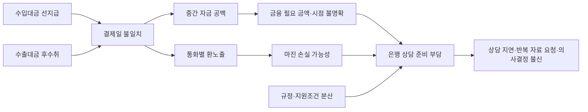
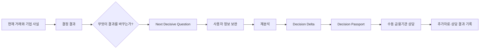
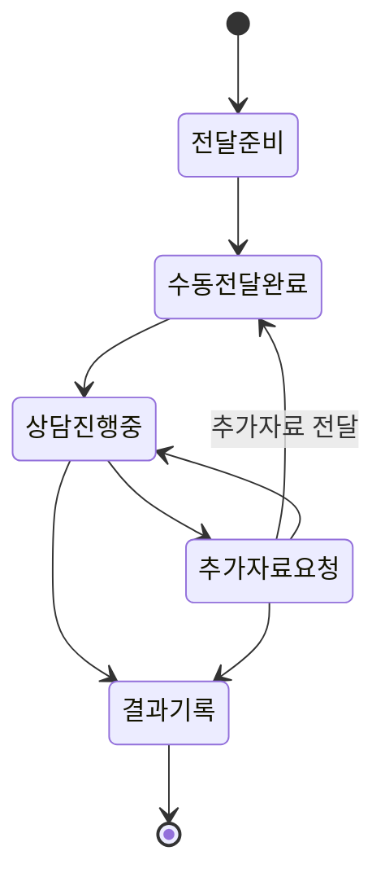
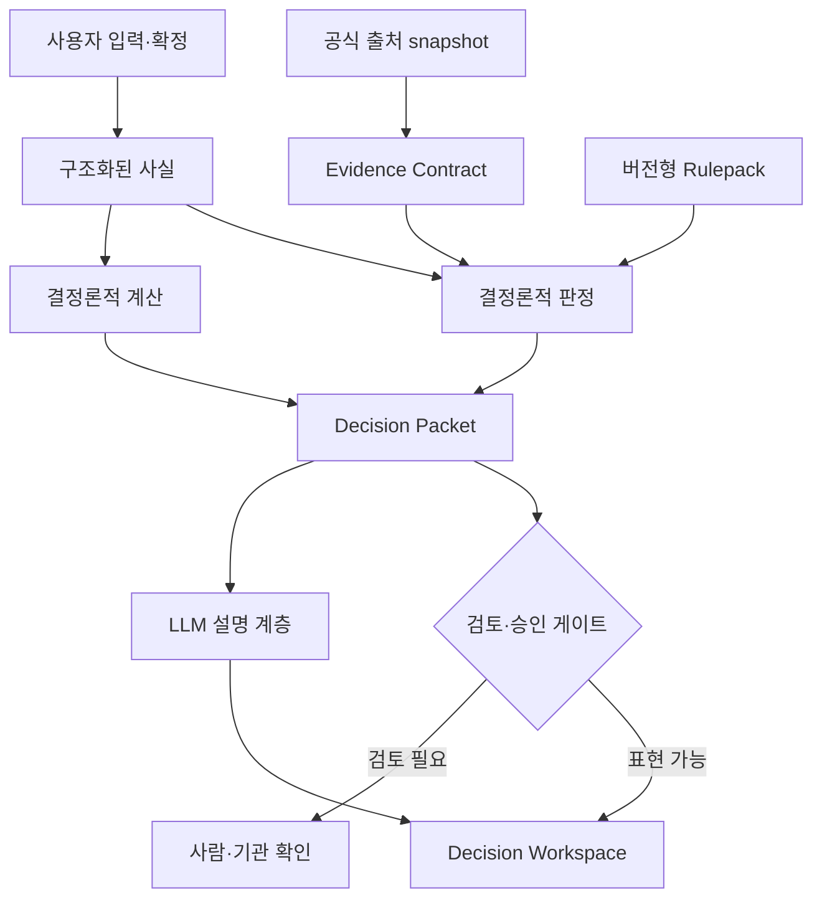
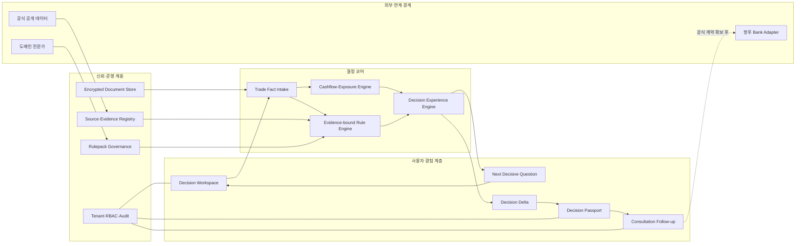
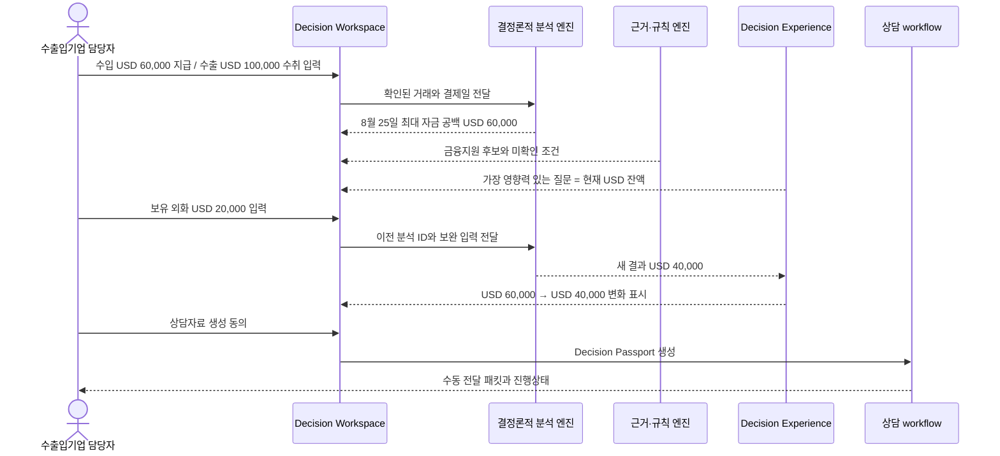

# TradeFlow 대회 제출 기획안

## 결과를 바꾸는 질문으로 수출입금융 의사결정을 완성하는 AI 워크스페이스

| 항목 | 내용 |
|---|---|
| 대회명 | [작성 필요: 대회 공식 명칭] |
| 출품 분야 | AI 에이전트 / 금융·수출입 업무 혁신 |
| 서비스명 | TradeFlow |
| 팀명·참가자 | [작성 필요] |
| 작성 기준일 | 2026-08-02 |
| 현재 단계 | 작동 가능한 MVP 및 자동화 검증 완료, 실제 고객·RM 파일럿 전 |

---

## 초록

수출입 중소·중견기업은 계약 전체로는 이익이 예상되더라도 수입대금 지급일과 수출대금
회수일이 달라 단기 자금 공백과 환노출을 동시에 겪는다. 그러나 기존의 계산 도구나 금융상품
추천 서비스는 결과만 제시하여, 사용자가 어떤 정보를 보완해야 판정이 달라지는지 알기 어렵고
은행 상담에서도 판단 근거를 다시 정리해야 한다. TradeFlow는 거래 일정을 기반으로 자금 공백과
환노출을 결정론적으로 계산하고, 결과를 바꾸는 다음 질문(Next Decisive Question), 정보 보완
전후 변화(Decision Delta), 사실·계산·규칙·출처가 결합된 상담자료(Decision Passport)를
연속적으로 제공한다. 생성형 AI는 설명을 담당하고 금액·판정은 검증 가능한 엔진이 생성한다.
현재 MVP는 고객 과업 benchmark 17/17, 구조화 검증 58/58과 브라우저 E2E 4/4를 통과했다.
본 기획은 AI의 “답”이 아니라 의사결정이 만들어지고 바뀌는 과정을 제품화하는 데 목적이 있다.

**핵심어:** 수출입금융, 자금 공백, 환위험, 결정지원, 설명가능 AI, Evidence, Decision Delta

---

## 1. 서론

### 1.1 연구·기획 배경

수출입기업의 금융 문제는 단순히 환율이 오르거나 내리는 문제가 아니다. 원자재 대금을 먼저
지급하고 완제품 수출대금을 나중에 받는 기업은 최종적으로 외화가 남더라도 중간 결제일에는
현금이 부족할 수 있다. 이때 기업은 다음 질문에 동시에 답해야 한다.

- 언제, 어떤 통화로, 얼마가 부족한가?
- 수출과 수입이 서로 상계되는 금액과 실제 결제일에 사용할 수 있는 금액은 얼마인가?
- 남은 환노출이 기업의 손익 한도를 얼마나 훼손할 수 있는가?
- 어떤 금융·보증·보험 후보를 검토할 수 있으며 무엇이 아직 확인되지 않았는가?
- 은행이나 전문가에게 어떤 사실과 서류를 가져가야 하는가?

전담 외환·무역금융 인력이 부족한 중소·중견기업은 이 문제를 엑셀, 담당자의 경험, 여러 기관의
웹페이지와 은행 상담을 오가며 해결한다. 정보가 흩어져 있을 뿐 아니라 입력 하나가 바뀔 때
결론 전체가 어떻게 달라지는지 추적하기 어렵다.

### 1.2 기획 질문

본 기획은 다음 질문에서 출발한다.

> AI가 금융 답변을 더 자연스럽게 생성하는 것을 넘어, 사용자가 실제 결정을 완성하도록
> “결과를 바꾸는 정보”를 찾아 묻고 그 변화와 근거를 증명할 수 있는가?

### 1.3 기획 범위

초기 범위는 반복적인 수출입 거래를 가진 중소·중견 제조기업의 `상담 전 의사결정 준비`다.
금융기관의 실제 대출 승인, 고객별 한도·금리 확정, 보험·보증 접수와 금융상품 판매는 포함하지
않는다. 현재 자동 계산 범위는 USD·T/T 거래이며, 미지원 결제방식은 지원되는 거래로 임의
변환하지 않는다.

---

## 2. 문제 정의

### 2.1 핵심 사용자

초기 핵심 사용자는 해외에서 원자재를 수입하고 가공한 제품을 수출하는 국내 중소·중견
제조기업이다. 이들은 수입과 수출 현금흐름을 함께 보아야 하지만 전담 인력이 부족하고, 은행에
상담하기 전 필요한 자금 규모와 준비자료를 스스로 구조화하기 어렵다.

### 2.2 기존 접근의 단절

| 기존 접근 | 제공하는 것 | 남는 문제 |
|---|---|---|
| 엑셀·수기 계산 | 거래별 입출금 합계 | 만기 불일치, 규칙·근거·변경 이력 연결이 약함 |
| 환위험 분석 도구 | 노출액·시나리오·헤지안 | 금융지원 조건과 상담자료가 분리됨 |
| 금융상품 검색 | 상품 설명과 대상 조건 | 기업의 실제 거래 일정·자금 공백과 연결되지 않음 |
| 범용 생성형 AI | 이해하기 쉬운 설명 | 계산 재현성, 최신 출처, 권한과 승인 경계가 불명확 |
| 은행 상담 | 실제 확인과 다음 절차 | 상담 전에 사실·금액·서류를 다시 정리해야 함 |

### 2.3 문제의 인과 구조


### 2.4 해결해야 할 본질

본질은 더 많은 상품을 추천하는 것이 아니다. 사용자의 거래를 기준으로 현재 결론을 만들고,
그 결론을 바꾸는 정보와 아직 확인할 권한이 남아 있는 기관을 구분하여, 실제 상담 가능한
상태까지 의사결정을 완성하는 것이다.

---

## 3. 전반적인 기획 주제

### 3.1 주제 문장

> **TradeFlow — 결과를 바꾸는 다음 질문을 찾아주는 수출입금융 의사결정 AI**

### 3.2 한 줄 가치 제안

> 수출입 지급·수취 일정을 입력하면 자금 공백과 환노출을 계산하고, 무엇을 확인하면 결과가
> 달라지는지 보여준 뒤, 그 변화와 근거를 금융기관 상담자료로 남긴다.

### 3.3 기획의 차별화 축

TradeFlow는 “환위험”이나 “금융상품 추천”이라는 주제 자체를 독점적 차별점으로 주장하지 않는다.
고유한 차이는 결과가 아니라 결정 과정의 세 단계를 제품화한 데 있다.

1. **Next Decisive Question:** 결과를 바꾸는 다음 정보 탐색
2. **Decision Delta:** 정보 보완 전후에 실제로 바뀐 결과만 비교
3. **Decision Passport:** 사실·계산·규칙·출처·미확인 조건을 상담자료로 보존



---

## 4. 기획 의도

### 4.1 사용자 관점

사용자가 분석 결과를 수동적으로 읽는 데서 끝나지 않고, 현재 결론이 왜 나왔는지와 어떤 정보를
보완하면 행동 가능한 결론으로 좁혀지는지를 이해하도록 한다. 최종적으로는 금융기관에 가기 전에
필요 자금, 환노출, 후보 제도, 준비자료와 확인 질문을 하나의 흐름으로 정리하게 한다.

### 4.2 금융기관·전문가 관점

상담 담당자가 AI의 자연어 문장을 그대로 신뢰하도록 요구하지 않는다. 사용자가 확인한 사실,
결정론적 계산, 적용 규칙, 공식 출처, 버전과 미확인 조건을 검토할 수 있는 패킷을 제공하여 상담
초기의 반복 확인 비용을 줄인다.

### 4.3 기술 관점

생성형 AI가 금액·자격·규정 결론을 직접 만들어 발생하는 환각과 재현성 문제를 줄인다. LLM은
구조화된 결과를 설명하는 표현 계층에 두고, 핵심 계산과 판정은 버전이 있는 코드·규칙·근거
엔진이 담당한다.

### 4.4 거버넌스 관점

미확인 사실, 만료된 출처와 독립 전문가 승인을 받지 않은 규칙을 확정 판정으로 승격하지 않는다.
KB 데이터나 API가 없는 현재는 자동 접수 대신 금융기관 중립 수동 패킷만 제공한다. 즉,
“할 수 있는 것”뿐 아니라 “누가 최종 확인해야 하는가”를 서비스 결과의 일부로 설계한다.

---

## 5. 필수 모듈 도출

기획 의도를 실제 사용자 경험으로 만들기 위해서는 다음 모듈이 모두 필요하다. 하나라도 빠지면
결과를 계산하더라도 결정의 변화나 상담 인계까지 완성할 수 없다.

| 모듈 | 해결하는 질문 | 핵심 입력 | 핵심 출력 | 기획 의도와의 연결 |
|---|---|---|---|---|
| M1 거래 사실 Intake | 사용자의 실제 거래는 무엇인가? | 자연어·구조화 거래·기업 사실 | 확인된 TradeCase와 누락정보 | 잘못 이해한 거래로 정상 결과를 만들지 않음 |
| M2 Cashflow·Exposure Engine | 언제 얼마가 부족하고 노출되는가? | 방향·통화·금액·결제일·잔액 | 자금 공백·순노출·자연헤지·만기상계 | 결과의 수치적 토대 |
| M3 Evidence-bound Rule Engine | 어떤 후보이며 무엇이 미확인인가? | 기업·거래 사실, 규칙, 공식 출처 | 후보 상태·이유·필요서류·검토권한 | 추천이 아닌 근거 기반 후보 제시 |
| M4 Next Decisive Question | 다음에 무엇을 물어야 하는가? | 현재 결과와 누락 필드 | 영향도가 가장 큰 질문 | 결과 변경 가능성을 사용자 행동으로 전환 |
| M5 Decision Delta | 답변으로 무엇이 달라졌는가? | 이전·현재 결정 패킷 | 계산·판정·행동의 전후 차이 | 전체 결과 반복 대신 변화 증명 |
| M6 Decision Passport | 상담에 무엇을 가져갈 것인가? | 사실·계산·규칙·출처·Delta | 재현 가능한 상담 패킷 | AI 결과를 실제 업무 산출물로 전환 |
| M7 Consultation Follow-up | 전달 후 어떻게 이어지는가? | 패킷·사용자 기록 | 전달·상담·추가자료·결과 이력 | 다운로드 이후 업무 단절 해소 |
| M8 Governance·Security | 무엇을 믿고 누가 볼 수 있는가? | tenant·역할·승인·버전 | 격리·감사·검토 상태 | 금융 의사결정의 안전 경계 |

---

## 6. 필수 모듈 구현 아이디어

### 6.1 M1 — 복합 거래를 “부분 성공”으로 처리하지 않는 Intake

한 문장에 수입과 수출이 함께 있을 때 일부 거래만 추출한 결과는 완전 실패보다 위험하다.
사용자는 모든 거래가 반영됐다고 오해할 수 있기 때문이다. 따라서 둘 이상의 거래 징후가
발견되면 곧바로 분석하지 않고 거래별 방향·금액·결제일을 후보로 보여준 뒤 확인받는다.

**사용 아이디어:** 불확실한 자동완성보다 `fail-closed confirmation`을 우선한다.

### 6.2 M2 — 결제일 기반 잔액 궤적으로 자금 공백 계산

통화 `c`, 시점 `t`의 예상 잔액을 다음과 같이 계산한다.

```text
B_c(t) = 기초 외화잔액
       + t까지의 수출대금 수취 합계
       - t까지의 수입대금 지급 합계

FundingGap_c = max(0, -min_t B_c(t))
```

경제적 자연헤지는 전체 수출·수입 금액의 상계 가능분이고, 만기상계는 실제 결제 시점에 사용할
수 있는 금액이다. 두 값을 분리하여 “전체로는 흑자지만 지급일에는 부족”한 상황을 표현한다.

**사용 아이디어:** 총액 차감이 아니라 날짜순 event ledger를 계산한다.

### 6.3 M3 — 규칙과 공식 출처를 함께 묶는 Evidence Contract

각 판정은 `규칙 ID`, `사용한 사실`, `공식 출처`, `관측·수집 시점`, `버전`, `검토 상태`를
함께 가진다. 사실이 없으면 `False`로 추정하지 않고 `insufficient_information`, 공식 확인이
필요하면 `expert_confirmation_required`로 남긴다.

**사용 아이디어:** Boolean 추천 대신 상태가 있는 결정 모델을 사용한다.

### 6.4 M4 — 결과 민감도를 질문 우선순위로 변환

모든 누락정보를 같은 순서로 묻지 않는다. 다음 기준으로 질문의 우선순위를 정한다.

```text
QuestionImpact = 계산 결과 변경 가능성
               + 차단된 후보 수
               + 안전·규정 영향
               + 사용자 행동 가능성
```

대표 시나리오에서는 현재 보유 외화가 최대 자금 공백을 즉시 바꾸므로 첫 질문이 된다.

**사용 아이디어:** 정보 수집량 최소화가 아니라 `결정을 바꾸는 정보량`을 최대화한다.

### 6.5 M5 — 두 결정 패킷의 구조적 차이 계산

동일한 규칙·계산 버전 아래 이전 입력 `I₀`와 보완 입력 `I₁`의 결과를 각각 `D₀`, `D₁`으로
계산하고 다음 차이를 구조화한다.

```text
DecisionDelta = compare(D₀, D₁)
              = 변경된 금액 + 후보 상태 + 누락정보 + 행동 + 필요서류
```

LLM이 두 문장을 요약 비교하는 것이 아니라 구조화된 필드 단위로 비교한다.

**사용 아이디어:** 설명 가능한 AI를 “설명 문장”이 아니라 “재현 가능한 전후 차이”로 구현한다.

### 6.6 M6 — 상담 가능한 최소 충분 정보 패킷

Decision Passport는 고객·거래, 자금 공백, 환노출, 후보, 누락 조건, 필요서류, 근거와 계산
버전을 포함한다. 업로드 문서는 원문 대신 문서 ID·종류·hash·확정 필드 inventory만 포함한다.
현재 수집하지 못한 희망 한도, 무역실적, 거래상대방 신용 근거는 숨기지 않고 미확인 목록으로
표시한다.

**사용 아이디어:** 완전한 신청서를 가장하지 않고 `검토 가능한 최소 결정 패킷`을 만든다.

### 6.7 M7 — 은행 미연계 상태에서도 닫히는 수동 workflow

KB API 없이도 사용자가 상담자료를 전달한 뒤 진행상태를 잃지 않도록 다음 event를 append-only로
저장한다.



모든 상태에는 `user_recorded_not_bank_verified`를 표시하여 은행 접수·승인 상태와 구분한다.

**사용 아이디어:** 외부 API 부재를 기능 공백으로 방치하지 않되, 자동 연계를 가장하지 않는다.

### 6.8 M8 — 생성형 AI와 금융판정 권한의 분리



**사용 아이디어:** LLM은 설명을 생성하지만 계산값·자격·규정 결론의 단일 진실 공급원이 되지
않는다.

---

## 7. 전체 시스템 설계

### 7.1 논리 아키텍처



### 7.2 대표 사용자 sequence



---

## 8. 대표 시나리오와 동작 결과

### 8.1 입력 시나리오

| 거래 | 금액 | 결제일 | 결제방식 |
|---|---:|---|---|
| 베트남 원자재 수입대금 지급 | USD 60,000 | 2026-08-25 | T/T |
| 미국 완제품 수출대금 수취 | USD 100,000 | 2026-10-24 | T/T |

### 8.2 최초 분석

- 경제적 자연헤지: USD 60,000
- 결제시점이 맞는 상계: USD 0
- 최대 자금 공백: USD 60,000
- 최종 수출 순노출: USD 40,000
- 첫 번째 결정 변경 질문: 현재 보유 USD 잔액

### 8.3 사용자 정보 보완

사용자가 현재 보유 외화 `USD 20,000`을 입력하면 다음 변화가 표시된다.

```text
최대 자금 공백     USD 60,000 → USD 40,000
변경 원인          기초 외화잔액 USD 20,000 반영
다음 확인사항      은행 사전상담 여부
```

### 8.4 상담 인계

사용자의 명시적 동의 후 Decision Passport를 생성한다. 자동 전송은 하지 않으며, 사용자가
수동 전달 완료·상담 진행·추가자료 요청·상담 결과를 기록할 수 있다.

---

## 9. 기술적·사용자 경험적 차별성

| 비교 기준 | 일반 금융 챗봇·추천 | 일반 환위험 분석 | TradeFlow |
|---|---|---|---|
| 핵심 출력 | 답변·상품 후보 | 노출·시나리오·헤지안 | 결정 결과와 그 결과를 바꾸는 정보 |
| 계산 방식 | 생성 문장에 혼재 가능 | 정량 모델 | 결정론적 계산과 LLM 설명 분리 |
| 누락정보 | 추가 질문 | 입력 오류 또는 공란 | 판정을 바꾸는 영향도 순 질문 |
| 결과 수정 | 전체 답변 재생성 | 재계산 | 변경된 금액·상태·행동만 Delta로 증명 |
| 근거 | 링크·설명 | 모델 값 | 사실·규칙·출처·버전·검토상태 결합 |
| 실제 업무 연결 | 상담 권유 | 보고서 | 재현 가능한 Passport와 후속 lifecycle |
| 권한 경계 | 모호할 수 있음 | 금융실행 별도 | 사용자 기록·전문가 확인·은행 결정을 명시적으로 분리 |

TradeFlow의 진입장벽은 특정 프롬프트가 아니라, 구조화된 거래 사실부터 계산·규칙·질문·변화·근거·
상담 이력까지 같은 ID와 버전으로 연결하는 결정 공급망에 있다.

---

## 10. 구현 현황과 검증 방법

### 10.1 구현 현황

| 영역 | 현재 상태 |
|---|---|
| 거래 intake와 복합 거래 확인 | 구현 완료 |
| 자금 공백·순노출·자연헤지·만기상계 | 구현 완료 |
| 공식 근거 기반 K-SURE·외국환 후보 | 구조 구현 완료, 전문가 승인 대기 |
| Next Decisive Question | 구현 완료 |
| Decision Delta | 구현 완료 |
| Decision Passport | 구현 완료 |
| 수동 상담 lifecycle | 구현 완료 |
| 문서 업로드·추출·사용자 확인·불일치 검사 | 구현 완료 |
| KB 실제 데이터·접수 API | 미연계, adapter 확장점으로 유지 |
| L/C·D/P·D/A·O/A·Usance | 미지원, fail-closed |

### 10.2 검증 설계

단순 함수 테스트뿐 아니라 고객이 끝까지 과업을 완료하는지를 검증한다.


| 검증 계층 | 현재 결과 | 검증 목적 |
|---|---:|---|
| Python 회귀 | 676 passed, 2 skipped | 계산·규칙·tenant·감사 계약 |
| React component | 23 passed | 사용자 상호작용과 상태 표현 |
| Playwright E2E | 4/4 | 브라우저→API→데이터→화면 전체 흐름 |
| 고객 과업 benchmark | 17/17 | 실제 업무 시나리오 완결성 |
| 구조화 check | 58/58 | 핵심 결과·안전 상태의 정확성 |
| Capability acceptance | 18/22 | 구현 범위와 미지원 능력의 투명성 |

### 10.3 실제 사용자 검증 계획

자동화 검증은 사용자의 이해와 현장 효용을 대체하지 않는다. 핵심 고객 조건에 가까운 기업
담당자와 RM을 대상으로 다음 지표를 측정한다.

- 거래 입력부터 상담자료 준비까지 과업 완료율
- 최대 자금 공백의 금액·시점 이해도
- 어떤 입력이 결과를 바꿨는지 설명할 수 있는 비율
- 기존 상담 준비 대비 시간 절감
- RM의 상담자료 유용성 평가
- 미확인 후보를 승인 결과로 오인한 비율

---

## 11. 안전성·거버넌스

### 11.1 비보상형 출시 게이트

다른 지표가 높아도 다음 중 하나가 실패하면 운영 출시로 승격하지 않는다.

- 복합 거래 일부만 반영한 정상 결과가 없어야 한다.
- 지원하지 않는 통화·결제방식을 지원 범위로 바꾸지 않아야 한다.
- 금액 계산은 동일 입력·버전에서 재현되어야 한다.
- 미확인 사실이나 만료 출처를 확정 판정으로 승격하지 않아야 한다.
- 상담자료가 자동 접수·은행 승인으로 오인되지 않아야 한다.

### 11.2 현재 외부 게이트

K-SURE와 외국환 규칙팩은 validation과 integrity 검증을 통과했지만 독립 도메인 전문가 승인을
받지 않았다. 따라서 `draft`, `production_ready=false`를 유지한다. 실제 고객·RM 파일럿도
아직 수행하지 않았으므로 자동화 benchmark 통과만으로 시장 효용을 확정하지 않는다.

### 11.3 KB 연계 원칙

- KB 내부 등급, 고객별 한도·금리·취급 가능 여부를 추정하지 않는다.
- 공개 웹페이지를 실행 API로 사용하지 않는다.
- 현재는 `manual_packet`, `transmission_performed=false`만 제공한다.
- 향후 공식 계약이 확보되면 핵심 도메인을 변경하지 않고 Bank Adapter를 추가한다.

---

## 12. 기대효과

### 12.1 고객 기대효과

- 총액만 보고 놓치기 쉬운 결제일 자금 공백을 사전에 발견한다.
- 불필요한 질문보다 현재 결정을 바꾸는 정보를 먼저 확인한다.
- 상담 전 거래·금액·후보·문서·질문을 한 번에 정리한다.
- 결과가 달라진 이유를 확인하여 AI에 대한 맹목적 신뢰를 줄인다.

### 12.2 금융기관 기대효과

- 초기 상담에서 반복되는 거래 사실과 준비자료 확인을 구조화한다.
- AI 문장 대신 재현 가능한 계산·규칙·출처를 검토한다.
- 미확인 조건과 추가자료 요청 이력을 추적한다.

### 12.3 기술·산업적 기대효과

- 설명가능 AI를 사후 설명이 아니라 결정 변화의 구조적 증명으로 구현한다.
- 금융기관별 API가 달라도 공통 Decision Passport를 중심으로 확장할 수 있다.
- 전문가 승인과 데이터 유효성을 제품 동작에 포함하여 규제·금융 AI의 과신을 방지한다.

정량 기대효과는 실제 pilot 이전에는 확정값으로 제시하지 않는다. 첫 pilot에서 상담 준비시간,
과업 완료율, 이해도와 추가자료 요청 건수를 기준선과 비교한다.

---

## 13. 추진 로드맵


대회 이후 실제 일정은 도메인 전문가와 파일럿 참여자 확보 시점에 따라 조정한다. 특히 규칙팩
승인과 금융기관 API는 팀 내부 개발 일정으로 완료 처리하지 않는다.

---

## 14. 한계와 향후 연구

1. 현재 자동 분석은 USD·T/T 중심이며 실제 수출입금융의 다양한 결제조건을 포괄하지 않는다.
2. `country_risk`, `buyer_credit`, `lc_review`, `support_policy_finance` capability가 남아 있다.
3. 희망 금융한도, 과거 무역실적과 거래상대방 신용 근거의 실제 데이터 계약이 필요하다.
4. 질문 영향도는 현재 구조화된 규칙·계산 변화 중심이며 사용자의 답변 비용까지 최적화하지 않는다.
5. 실제 고객과 RM의 과업 이해도·시간 절감·상담 전환 효과는 pilot로 검증해야 한다.
6. 금융기관 연계 후에는 동의 철회, 접수 멱등성, callback 검증과 reconciliation 연구가 필요하다.

---

## 15. 결론

TradeFlow의 핵심은 환위험 수치를 한 번 더 보여주거나 금융상품을 추천하는 데 있지 않다.
수출입기업의 거래 일정에서 자금 공백과 환노출을 계산하고, 현재 결과를 바꾸는 정보를 찾아
질문하며, 정보 보완 전후의 변화를 증명하고, 그 결정 과정을 금융기관이 검토할 수 있는 자료로
전환하는 데 있다.

즉, TradeFlow는 “AI가 무엇이라고 답했는가”보다 “어떤 사실과 근거로 결정이 만들어졌고,
무엇이 그 결정을 바꾸었는가”를 제품화한다. 이 구조는 유사한 환위험·수출입금융 주제 안에서도
사용자가 즉시 경험할 수 있는 차별점이며, 향후 KB를 포함한 금융기관 연계가 가능해질 때도 핵심
도메인을 보존할 수 있는 확장 기반이다.

> **TradeFlow는 답만 하지 않습니다. 무엇이 답을 바꾸는지 보여줍니다.**

---

## 참고 문서

1. [KB금융그룹 수출입금융 조직 및 서비스 조사](../research/kb-export-import-finance.md)
2. [고객층 조사 기반 서비스 및 KB 연계 준비도 리뷰](customer-and-kb-service-review.md)
3. [실제 사용자 시나리오 기반 서비스 효용 검증](user-scenario-utility-validation.md)
4. [Decision Delta 차별화 전략](decision-delta-differentiation.md)
5. [고객 과업 benchmark](user-task-benchmark.md)
6. [MVP 아키텍처](../specifications/mvp-architecture.md)
7. [금융기관 중립 상담 인계 ADR](../adr/0028-bank-neutral-consultation-handoff.md)

---

## 부록 A. 심사위원용 30초 요약

```text
문제
수입대금은 먼저 지급하고 수출대금은 나중에 받아,
전체 거래가 이익이어도 결제일에는 자금이 부족합니다.

해결
TradeFlow는 자금 공백과 환노출을 계산한 뒤
“무엇을 확인하면 결과가 달라지는지”를 먼저 질문합니다.

차별화
Next Decisive Question → Decision Delta → Decision Passport

검증
고객 과업 17/17, 구조화 검증 58/58, 브라우저 E2E 4/4

안전성
금액·판정은 결정론적 엔진이 만들고,
미확인 조건과 은행의 최종 판단은 확정적으로 표현하지 않습니다.
```
