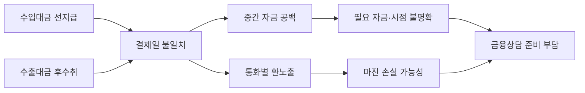
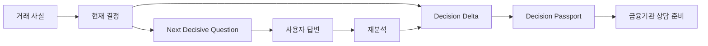
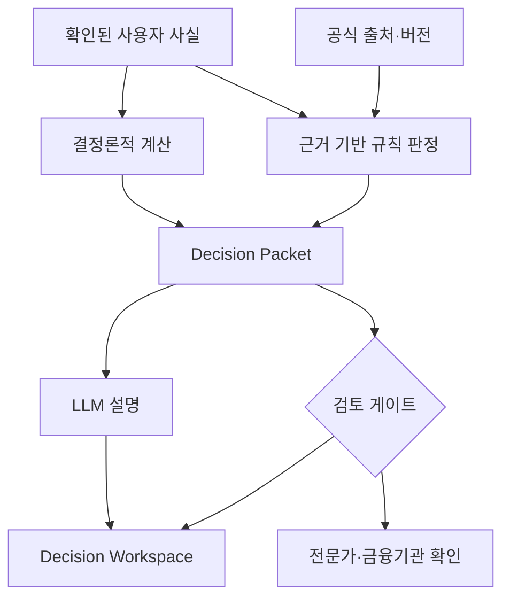

# 제8회 Future Finance AI Challenge 제출 기획안 작성 계획

## 1. 목적과 시간 기준

이 문서는 KB Comme를 `2026 KB AI Challenge` 예선에 제출하기 위한 기획안 작성과 제출물
완성 절차를 정의한다. 제출용 기획안은 일반적인 서비스 소개서가 아니라 공식 평가항목 100점에
각 주장과 증거를 직접 대응시키는 기술설명서로 만든다.

공식 예선 제출 마감은 **2026년 8월 3일 16:00 KST**다. 홈페이지는 마감 직전 접속 집중을
경고하고 있으므로 내부 제출 완료시각은 **2026년 8월 3일 14:00 KST**로 정한다.

## 2. 제출 전략

### 2.1 출품 트랙

**권고: 금융 관련 자유주제**

KB Comme는 현직자 Pick의 `TradePilot FX` 및 `KB 환부장`과 환위험 관리라는 기반을 공유하지만,
특정 Pick 주제를 그대로 구현한 서비스가 아니다. 환위험과 결제일 자금 공백을 함께 계산하고,
의사결정을 바꾸는 질문과 변화 증명, 금융기관 상담 준비까지 연결하는 독립적인 문제 정의이므로
자유주제로 제출하는 편이 구현 범위와 차별성을 정확하게 설명할 수 있다.

### 2.2 과제명과 부제

> **KB Comme - 결과를 바꾸는 질문부터 금융상담 준비까지 연결하는 수출입금융 의사결정 AI**

> 환위험과 결제일 자금 공백을 함께 분석하고, 정보 보완 전후의 결정 변화를 증명한다.

### 2.3 핵심 주장

> KB Comme는 환위험을 한 번 더 분석하는 서비스가 아니다. 수출입 거래의 결제일 자금 공백과
> 환노출을 함께 계산하고, 무엇이 결과를 바꾸는지 질문한 뒤 그 변화와 근거를 금융기관이
> 검토할 수 있는 상담자료로 만든다.

다음 세 기능을 출품작의 고유한 제품 경험으로 전면에 둔다.

1. `Next Decisive Question`: 현재 결론을 가장 크게 바꾸는 다음 정보를 선택한다.
2. `Decision Delta`: 정보 보완 전후에 바뀐 금액·상태·행동만 구조적으로 비교한다.
3. `Decision Passport`: 사실·계산·규칙·출처·미확인 조건을 재현 가능한 상담자료로 묶는다.

## 3. 공식 제출물과 산출물

| 공식 제출물 | 작성 산출물 | 완료 기준 |
|---|---|---|
| 참가신청서 | 공식 PDF 작성본 | 과제 요약, 팀 정보, AI 활용 내역, 서명 완비 |
| 기술설명서 | 15장 내외 PowerPoint와 PDF 확인본 | 평가항목 6개와 데모 증거 포함 |
| 프로토타입 | 소스코드 ZIP | 새 환경 실행 안내, 비밀정보 제거, 데모·테스트 재현 가능 |
| 서약서 | 팀원별 공식 PDF | 저작권·AI 도구·데이터 준수 확인과 서명 |
| 개인정보 동의서 | 팀원별 공식 PDF | 필수 항목과 서명 완비 |

공식 압축파일에는 기술설명서 전용 PPT 템플릿이 없다. 제출 덱은 16:9 화면비의 독자 양식으로
제작하되, 각 장 하단에 `평가항목`과 `검증 근거`를 짧게 표시한다.

참가신청서의 AI 활용 내역은 실제 사용 사실에 맞춰 작성한다. 현재 확인 가능한 내용은 Codex를
통한 정보수집 보조, 코드 작성·디버깅, 문서 작성이다. 다른 모델·도구와 반영 정도는 팀 확인 후
기재하며, 사용하지 않은 영역을 임의로 표시하지 않는다.

## 4. 평가항목별 득점 설계

| 평가항목 | 배점 | 심사 질문 | 핵심 내용 | 증거 |
|---|---:|---|---|---|
| 문제 정의 및 필요성 | 15 | 왜 지금 이 고객에게 필요한가? | 수입 선지급·수출 후수취의 결제일 공백과 환노출, 전담 인력 부족 | 고객층 조사, 거래 타임라인, 업무 단절도 |
| 아이디어 활용 가능성 | 15 | 실제 업무에서 어디까지 쓰이는가? | 거래 입력부터 상담자료와 후속 기록까지 닫힌 흐름 | 사용자 시나리오, 고객 과업 17/17, 상담 lifecycle |
| 아이디어 창의성 및 효과 | 20 | 유사 환위험 서비스와 무엇이 다른가? | NDQ -> Decision Delta -> Decision Passport | 전후 변화 화면, 유사 주제 비교, 효과 측정계획 |
| 기술 적정성 | 20 | 왜 이 구조와 AI가 적절한가? | 결정론적 계산·규칙 엔진과 LLM 설명 계층 분리 | 아키텍처, 계산식, 버전·출처·검토 게이트 |
| 개발 계획의 구체성 | 15 | 무엇이 구현됐고 무엇이 남았는가? | 구현/부분 구현/외부 의존을 구분한 로드맵 | 모듈 현황, Bank Adapter, 파일럿 계획 |
| 기술 실현 가능성 | 15 | 지금 실제로 동작하는가? | 실행 가능한 MVP와 자동화 검증 | Python 676, React 23, E2E 4/4, benchmark 17/17·58/58 |

### 득점 원칙

- 완성되지 않은 기능을 현재 기능처럼 표현하지 않는다.
- 정량 수치는 실행 로그·테스트·벤치마크와 연결한다.
- 실제 고객 효용은 아직 파일럿 전임을 밝히고 `검증 완료`와 `검증 예정`을 구분한다.
- K-SURE·외환 규칙팩은 도메인 전문가 승인 전 `draft`임을 안전장치로 설명한다.
- KB 데이터·API 연계는 구현 완료로 주장하지 않고 현재 수동 인계와 향후 Adapter를 분리한다.

## 5. 마스터 기획안 구조

마스터 기획안은 논문에 가까운 구조로 작성하고, 기술설명서 PPT는 이를 요약한다.

1. **초록** - 문제, 제안, 차별성, 현재 검증 결과
2. **서론** - 고객층, 업무 배경, 기획 질문과 범위
3. **문제 정의** - 현재 업무와 실패 지점, 문제의 인과구조
4. **관련 접근과 한계** - 엑셀, 환위험 분석, 상품 추천, 범용 AI, 은행 상담 비교
5. **제안 서비스** - 가치 제안과 전체 사용자 흐름
6. **핵심 기여** - Next Decisive Question, Decision Delta, Decision Passport
7. **필수 모듈** - intake, 자금공백·환노출, 근거 규칙, 결정 변화, 상담 인계, 거버넌스
8. **기술 설계** - 결정론적 코어와 LLM 경계, 데이터·규칙 버전, 보안과 감사
9. **구현 결과** - 화면, API, 모듈별 구현 상태
10. **실험과 검증** - 대표 시나리오, benchmark, 회귀·E2E, 실패 케이스
11. **KB 연계 전략** - 수동 패킷의 현재 경계와 Bank Adapter 확장 구조
12. **한계와 개발계획** - 도메인 승인, 고객·RM 파일럿, 미지원 결제방식
13. **기대 효과와 결론** - 고객·금융기관 효과, 측정 지표, 핵심 메시지

## 6. 기술설명서 슬라이드 계획

### 6.1 커뮤니케이션 목표

> 심사위원이 발표자료를 끝까지 읽었을 때, KB Comme가 단순 환위험 분석 도구가 아니라
> `결제일 자금 공백 발견 -> 결정 변경 질문 -> 변화 증명 -> 금융상담 준비`를 실제 코드로
> 연결한 서비스이며, 현재 구현 범위와 향후 KB 연계 경계가 신뢰할 수 있게 설계됐다고 판단하게 한다.

자료는 `문제 -> 기존 방식의 단절 -> 고유한 해결 경험 -> 기술적 신뢰 -> 실행 가능성` 순서로
진행한다. 표지 다음에 일반적인 목차나 요약 카드를 두지 않고 대표 거래의 긴장을 바로 제시한다.

### 6.2 4막 구성

| 막 | 슬라이드 | 심사위원에게 남길 판단 |
|---|---:|---|
| 1. 문제의 긴장 | 1-4 | 계약 전체는 흑자여도 결제일에는 자금이 부족하며, 환위험만으로는 이 문제를 설명할 수 없다. |
| 2. 고유한 해결 경험 | 5-8 | KB Comme는 결과뿐 아니라 결과를 바꾸는 질문·변화·상담자료를 연결한다. |
| 3. 기술과 구현 증거 | 9-12 | 금액과 판정은 재현 가능한 엔진이 만들고, 지원 범위의 과업은 실제 코드로 검증됐다. |
| 4. 금융기관 연계와 결론 | 13-15 | 현재 권한을 넘지 않으면서도 KB 연계를 수용할 구조와 현실적인 검증계획이 있다. |

### 6.3 본문 15장 스토리보드

| 장 | 관객에게 보이는 제목 | 이 장의 단일 주장 | 주 시각자료 | 근거·평가항목 |
|---:|---|---|---|---|
| 1 | **KB Comme - 결과를 바꾸는 수출입금융 AI** | 서비스의 정체성은 환율 예측이 아니라 결정 완성이다. | 최소 표지, 제품명, 한 줄 부제 | 전체 |
| 2 | **계약은 흑자인데, 결제일에는 USD 60,000이 부족합니다** | 수출 USD 100,000이 예정돼도 수입대금 지급일에는 유동성 공백이 생긴다. | 8/25 지급과 10/24 수취 타임라인, 공백 강조 | 문제 정의·필요성 |
| 3 | **환위험만 보면 자금 문제의 절반을 놓칩니다** | 경제적 자연헤지와 결제시점 상계는 다른 값이다. | `자연헤지 USD 60,000` 대 `만기상계 USD 0` 비교 | 문제 정의·창의성 |
| 4 | **기존 도구는 분석과 상담을 분리합니다** | 엑셀, 환위험 도구, 상품 검색과 은행 상담 사이에 의사결정 단절이 있다. | 끊어진 현재 업무 흐름 | 필요성 |
| 5 | **KB Comme는 결정의 전 과정을 연결합니다** | 서비스가 분석 리포트에서 끝나지 않고 행동 가능한 상담 준비로 닫힌다. | 전체 사용자 여정 | 활용 가능성 |
| 6 | **결과를 가장 크게 바꾸는 질문을 먼저 찾습니다** | Next Decisive Question은 누락정보를 나열하지 않고 결과 영향도로 우선순위를 정한다. | 현재 결정과 `보유 외화가 있습니까?` 질문 | 창의성·효과 |
| 7 | **답변 전후에 바뀐 것만 증명합니다** | USD 20,000 입력으로 공백이 USD 60,000에서 USD 40,000으로 바뀐 원인을 보여준다. | 실제 화면 기반 Before/After, Decision Delta | 창의성·활용성 |
| 8 | **결정 근거를 상담자료로 보존합니다** | 사실·계산·규칙·출처·미확인 조건이 Decision Passport로 이어진다. | Passport 실제 화면 또는 산출물 | 창의성·효과 |
| 9 | **결제일 원장이 자금 공백과 환노출을 함께 계산합니다** | 총액 차감이 아니라 날짜순 잔액 궤적으로 실제 부족 시점과 금액을 계산한다. | 잔액 궤적 차트와 최소 계산식 | 기술 적정성 |
| 10 | **LLM은 설명하고, 엔진은 금액과 판정을 책임집니다** | 생성형 AI의 역할과 금융판정 권한을 분리해 재현성과 안전성을 확보한다. | 사실 -> 계산·규칙 -> Packet -> LLM 구조 | 기술 적정성 |
| 11 | **고객 과업은 실제 코드로 끝까지 재현됩니다** | 프로토타입은 화면 모형이 아니라 브라우저·API·데이터 흐름이 동작한다. | 17/17, 58/58, E2E 4/4 중심의 검증 수치 | 실현 가능성 |
| 12 | **모르는 조건을 확정하지 않는 금융 AI** | 미지원 입력, 만료 출처와 draft 규칙을 확정 결과로 승격하지 않는다. | `확정/정보부족/전문가확인` 상태 흐름 | 기술 적정성·실현 가능성 |
| 13 | **현재는 수동 인계, 향후에는 KB Adapter** | 현재 수동 인계와 미래 자동 연계를 같은 인터페이스 안에서 명확히 구분한다. | 현재 `manual packet` / 미래 `KB Adapter` 양분 구조 | 개발 계획 |
| 14 | **남은 공백은 파일럿과 도메인 승인으로 닫습니다** | 외부 검증 병목과 미지원 범위를 숨기지 않고 실행순서와 성공지표를 제시한다. | 구현완료 -> 파일럿 -> 전문가 승인 -> 연계 로드맵 | 개발 계획·실현 가능성 |
| 15 | **KB Comme는 무엇이 답을 바꾸는지 보여줍니다** | 처음의 USD 60,000 문제를 USD 40,000과 상담 준비라는 결과로 해결하며 마무리한다. | 2장의 문제와 7-8장의 결과를 한 줄로 회수 | 창의성·효과 |

### 6.4 슬라이드별 정보 밀도

- 1, 2, 6, 15장은 한 문장과 하나의 시각 요소만 두는 저밀도 슬라이드로 사용한다.
- 3, 4, 7, 13장은 두 상태를 비교하되 UI 카드 모음처럼 보이지 않게 하나의 좌우 구도로 만든다.
- 5, 10, 12, 14장의 흐름도는 5-7개 노드로 제한하고 세부 계약은 부록으로 보낸다.
- 9장은 차트를 가장 큰 증거 영역으로 사용하고 계산식은 한 줄만 남긴다.
- 11장은 모든 테스트 수치를 나열하지 않고 `고객 과업`, `구조화 검증`, `브라우저 E2E`를
  전면에 두며 Python·React 회귀 수치는 하단 근거로 둔다.

### 6.5 권장 레이아웃과 시각 체계

16:9, 흰 배경, 검은 본문, 옅은 회색 구조선으로 구성한다. 강조색은 하나만 사용하며 실제 제작
시 KB 계열의 노란색을 쓸지 기본 파란색을 쓸지 표지 시안 단계에서 확정한다. 장식용 아이콘보다
실제 제품 화면, 거래 타임라인, 잔액 궤적과 검증 수치를 우선한다.

| 용도 | 권장 실루엣 |
|---|---|
| 표지·결론 | 큰 문장 중심의 sparse cover |
| 대표 거래·실제 화면 | 절반 텍스트, 절반 이미지 |
| 기존 방식·현재/미래 비교 | 하나의 좌우 비교 구도 |
| NDQ -> Delta -> Passport | 3단계 수평 흐름 |
| 계산 결과 | 차트 중심 + 해석 문장 |
| 검증 결과 | 큰 수치 3개 + 짧은 의미 |
| 로드맵 | 3-4개 milestone 타임라인 |

### 6.6 부록 5장

| 부록 | 내용 | 사용하는 상황 |
|---:|---|---|
| A1 | 8개 필수 모듈과 실제 구현 경로 | 구현 상세 질문 |
| A2 | 고객 과업 17개와 실패·경계 테스트 목록 | benchmark 설계 질문 |
| A3 | Decision Packet·Evidence Contract 예시 | 데이터·AI 구조 질문 |
| A4 | 지원·미지원 capability와 fail-closed 기준 | 범위·완성도 질문 |
| A5 | 공식 출처, 용어와 검증 명령 | 근거·재현성 질문 |

본문은 코드 설명보다 고객의 실제 결정이 어떻게 바뀌는지를 먼저 보여준다. 세부 API, 긴 표,
전체 모듈 목록과 출처는 부록으로 이동한다.

## 7. 필수 시각자료

### 7.1 문제의 인과 구조



### 7.2 차별화된 결정 루프



### 7.3 기술 신뢰 경계



PPT 제작 시 Mermaid는 SVG 또는 고해상도 이미지로 변환한다. 제품 화면은 실제 브라우저 실행
결과를 캡처하고, 아직 구현되지 않은 화면은 명확히 `Concept`로 표시한다.

## 8. 대표 검증 시나리오

### 8.1 본문 데모

```text
수입: 2026-08-25, USD 60,000 지급, T/T
수출: 2026-10-24, USD 100,000 수취, T/T
초기 외화잔액: 미확인
```

1. 두 거래가 하나의 Trade Program으로 모두 반영된다.
2. 최초 최대 자금 공백은 USD 60,000이고 기간은 60일로 표시된다.
3. 현재 보유 외화를 가장 영향력 있는 다음 질문으로 제시한다.
4. USD 20,000 입력 후 최대 자금 공백은 USD 40,000으로 바뀐다.
5. Decision Delta가 바뀐 금액, 원인과 다음 행동만 표시한다.
6. Decision Passport가 사실·계산·규칙·출처·미확인 조건을 포함한다.
7. 은행 API가 없으므로 `수동 전달`, `은행 미검증` 상태로 기록된다.

### 8.2 실패·경계 시나리오

- 복합 거래 중 일부만 추출되면 자동 분석하지 않고 사용자 확인을 요청한다.
- 미지원 통화·결제방식을 지원 거래로 임의 변환하지 않는다.
- 만료된 출처나 draft 규칙팩은 확정 후보 판정에 사용하지 않는다.
- 사용자 상담 기록을 KB의 실제 접수·승인 상태로 표현하지 않는다.
- 다른 tenant의 거래·문서와 결정 패킷을 조회할 수 없다.
- 같은 입력·규칙·데이터 버전은 같은 결정 패킷을 재현한다.

## 9. 증거 자산과 공백

| 주장 | 현재 증거 | 제출 전 조치 |
|---|---|---|
| 고객 문제가 존재한다 | 고객 유형·업무 패턴 조사 | 핵심 근거를 3장에 압축 |
| 지원 범위의 과업이 완결된다 | 고객 과업 17/17, check 58/58 | 최종 커밋에서 재실행 |
| 브라우저에서 동작한다 | Playwright E2E 4/4 | 대표 흐름 연속 캡처 |
| 핵심 모듈이 회귀에 안전하다 | Python 676, React 23 | 환경·커밋 hash·실행시간 기록 |
| 전체 요구범위가 완성됐다 | Capability 18/22 | 4개 미지원 능력을 로드맵화 |
| 실제 고객 효용이 입증됐다 | 아직 없음 | 고객·RM 파일럿 계획 제시 |
| 규칙이 운영 승인됐다 | 아직 없음 | draft와 전문가 승인 게이트 설명 |
| KB 시스템과 연동된다 | 실제 API 없음 | Bank Adapter와 수동 인계만 제시 |

## 10. 작성·검증 일정

마감 전날이므로 범위 추가보다 제출 증거의 일관성을 우선한다.

| 종료시각 | 작업 | 게이트 |
|---|---|---|
| 8월 2일 +2시간 | 공식 요건·평가표, 주장·증거 매핑 | 이 계획서 승인 |
| 8월 2일 +5시간 | 마스터 기획안 개정 | 공식명·초록·13개 본문 구조 완성 |
| 8월 2일 +8시간 | 15장 기술설명서 초안 | 평가항목 6개 모두 명시 |
| 8월 2일 +10시간 | 화면·다이어그램·테스트 증거 삽입 | 구현 화면과 Concept 구분 |
| 8월 3일 10:00 | 회귀·대표 데모 재실행 | 최종 커밋 로그와 캡처 |
| 8월 3일 11:30 | 팀 리뷰·사실검증 | 과장, 개인정보, 외부 승인 표현 점검 |
| 8월 3일 12:30 | 참가신청서·AI 활용·서명 | 팀원별 필수서류 완비 |
| 8월 3일 13:00 | ZIP 조립·새 폴더 설치시험 | README만으로 재현, 비밀정보 없음 |
| 8월 3일 14:00 | 내부 제출 완료 | 업로드 후 파일·상태 재확인 |
| 8월 3일 16:00 | 공식 마감 | 내부적으로 이 시각까지 작업하지 않음 |

## 11. 제출 ZIP 검수표

### 문서

- [ ] 참가신청서 과제명과 기술설명서 표지가 동일하다.
- [ ] 팀원별 서약서·개인정보 동의서에 날짜와 서명이 있다.
- [ ] AI 활용 모델·도구와 반영 정도가 실제 사용 내역과 일치한다.
- [ ] PPT의 폰트·도형·링크가 다른 PC에서도 깨지지 않는다.
- [ ] 확인용 PDF에 잘림, 겹침, 깨진 한글, 작은 글씨가 없다.
- [ ] 모든 테스트 수치는 최종 제출 커밋에서 재현된다.

### 프로토타입

- [ ] README에 요구환경, 설치, 실행, 데모 입력, 테스트 명령이 있다.
- [ ] `.env`, API key, 개인·고객 데이터, 로컬 DB와 로그가 제외됐다.
- [ ] `node_modules`, 가상환경, cache와 임시 파일이 제외됐다.
- [ ] `.env.example`은 비밀값 없이 필요한 변수명만 포함한다.
- [ ] 깨끗한 임시 폴더에서 설치·기동·데모·benchmark를 재현한다.
- [ ] 제출 소스와 PPT의 기능·제한사항이 일치한다.

### 제출

- [ ] ZIP 파일명에 팀명과 과제명이 식별 가능하다.
- [ ] ZIP을 다시 풀어 문서와 소스가 정상적으로 열린다.
- [ ] 홈페이지 업로드 뒤 파일명·크기·제출완료 상태를 확인한다.
- [ ] 최종 ZIP, 제출 화면과 제출시각을 별도 보관한다.

## 12. 완료 정의

1. 평가항목 6개마다 핵심 주장, 구현 증거와 한계가 연결된다.
2. 기술설명서만 읽어도 고객 문제 -> 결정 변화 -> 상담 준비가 이해된다.
3. 대표 데모가 실제 실행 결과와 일치하고 같은 입력에서 재현된다.
4. 유사 주제와 겹쳐도 KB Comme의 고유 경험이 한 화면에서 식별된다.
5. KB 연계는 확장 가능한 Adapter와 권한 경계로 정확히 표현된다.
6. 실제 고객 파일럿과 도메인 승인 전인 사항을 완료된 효용으로 과장하지 않는다.
7. 참가신청서, 기술설명서, 코드와 필수서류가 내부 마감 전에 하나의 ZIP으로 검증된다.

## 13. 공식 근거

- [2026 KB AI Challenge 상세 정보](https://kb-aichallenge.com/info)
- [참가신청 및 공식 서류 다운로드](https://kb-aichallenge.com/intro)
- [예선 평가 기준](https://kb-aichallenge.com/community/notice/7wfSxwmnMdSHIesfGZlD)
- [현직자 Pick 주제 리스트](https://kb-aichallenge.com/community/notice/LiMNXWsm5FCxjURF3OtN)
- [대회 FAQ](https://kb-aichallenge.com/community)
