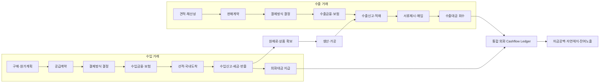
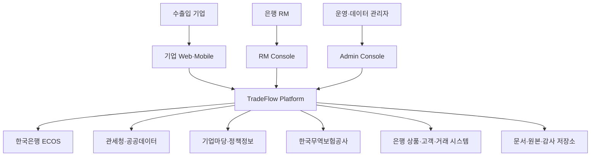
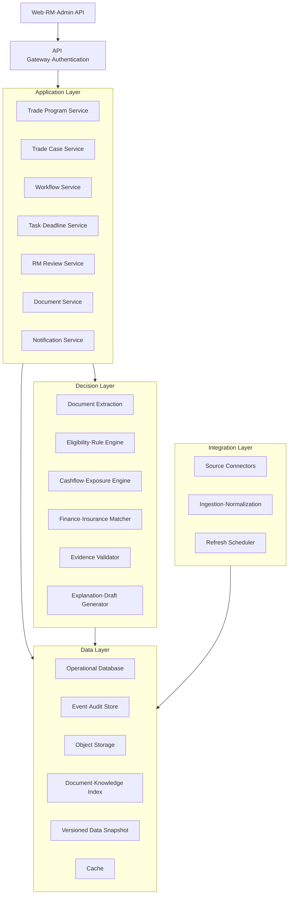

# TradeFlow 통합 수출입 금융 플랫폼 기획서

> 작성 기준일: 2026-07-26  
> 문서 상태: Product/Architecture Draft v0.1  
> 대상: 수출입 중소기업, 은행 기업금융 RM, 무역금융 운영 담당자

## 1. 문서 목적

이 문서는 전담 외환·무역금융 인력이 부족한 중소기업이 수출입 거래를 안전하게 계획하고 실행할 수 있도록 지원하는 독립형 수출입 금융 플랫폼의 제품 범위와 시스템 아키텍처를 정의한다.

플랫폼은 단순한 정보 검색이나 금융상품 추천에 그치지 않고 다음 업무를 하나의 거래 단위로 연결한다.

- 수출·수입 계약 및 결제조건 구조화
- 거래국가·상대방·결제방식의 위험 확인
- 수입 지급과 수출 수취를 결합한 외화 현금흐름 계산
- 무역금융·보증·보험·정책자금 후보 탐색
- 신용장과 무역서류의 조건 및 정합성 검토
- 신청서류·상담자료·업무 체크리스트 작성
- 선적일·결제일·신청 마감·위험 변화 모니터링
- 불확실하거나 고위험인 거래의 은행 RM 검토

## 2. 제품 개요

### 2.1 제품명

**TradeFlow**

### 2.2 한 문장 정의

> 수출입 계약을 거래 데이터로 전환하여 자금, 환위험, 금융지원, 보험, 서류 및 일정을 대금 지급·회수 완료까지 관리하는 무역금융 실행 플랫폼

### 2.3 핵심 고객

#### 1차 고객

- 전담 외환·재무 인력이 없는 수출입 중소기업
- 대표, 경영지원팀, 자금 담당자 또는 무역실무 담당자가 금융업무를 함께 처리하는 기업
- 수출입 거래는 있으나 신용장, 보험, 보증, 정책자금 활용 경험이 적은 기업
- 복수의 수입 지급과 수출 수취 일정을 스프레드시트로 관리하는 기업

#### 2차 고객

- 은행 기업금융 RM
- 무역금융·외환·여신 운영 담당자
- 수출지원기관 및 무역보험 상담 담당자

### 2.4 고객이 해결하려는 일

> “이 거래에서 언제 얼마의 외화가 필요하거나 들어오며, 어떤 위험이 있고, 어떤 금융·보험을 검토해야 하고, 지금 어떤 서류와 행동을 준비해야 하는가?”

## 3. 문제 정의

### 3.1 현재 업무의 단절

중소기업의 수출입 금융 업무는 다음과 같이 여러 기관과 문서에 분산되어 있다.

- 계약과 거래조건: 계약서, 견적서, Purchase Order
- 결제: 은행 외환·무역금융 창구
- 환율: 한국은행·은행 환율 정보
- 보험·보증: 한국무역보험공사
- 정책자금: 기업마당·중진공 등
- 통관: 관세청·관세사
- 선적: 포워더·선사·항공사
- 내부 관리: 이메일, 메신저, 스프레드시트

이 구조에서는 정보 자체보다 다음 문제가 더 크다.

1. 거래조건을 어떤 금융업무로 연결해야 하는지 판단하기 어렵다.
2. 수입 지급과 수출 수취를 별도로 관리해 기업 전체의 순환노출을 알기 어렵다.
3. 상품·보험·지원사업의 자격과 신청기한을 지속적으로 확인하기 어렵다.
4. 계약, 신용장, Invoice, Packing List, B/L 간 불일치가 늦게 발견된다.
5. 은행 상담을 위해 동일한 기업·거래정보를 반복해서 정리해야 한다.
6. 판단에 사용한 데이터의 출처와 기준시점을 사후에 설명하기 어렵다.

### 3.2 제품이 해결하지 않는 문제

초기 제품은 다음 기능을 제공하지 않는다.

- 미래 환율의 방향이나 가격을 확정적으로 예측
- 기업 또는 거래상대방의 공식 신용등급 산정
- 특정 금융상품의 가입 적합성이나 승인 여부 확정
- 은행 계좌에서 외환거래·대출·보험 가입을 자동 실행
- 관세사 확인 없이 HS Code·세율·수입요건을 최종 확정
- 세관·은행·보험기관을 대신한 법적 승인 또는 심사

## 4. 제품 설계 원칙

### 4.1 거래 중심

모든 정보와 실행은 채팅 세션이 아니라 `TradeProgram`과 `TradeCase`에 귀속한다.

### 4.2 수출·수입 통합

수출과 수입은 서로 다른 업무 흐름을 가지지만 기업의 외화 현금흐름에서는 함께 계산한다.

### 4.3 계산과 언어 생성의 분리

금액, 환노출, 일정, 조건 판정은 결정론적 규칙과 계산기로 처리한다. 생성형 AI는 문서 구조화, 설명, 요약 및 초안 작성에 제한적으로 사용한다.

### 4.4 근거 우선

모든 제도·상품·위험 안내에는 출처, 공표일, 효력기간, 조회시각과 최신성 상태를 보존한다.

### 4.5 불확실성의 명시

데이터가 없거나 조건이 충돌하면 추정으로 채우지 않고 `정보 부족`, `조건부 가능`, `전문가 확인 필요`로 분류한다.

### 4.6 사람의 최종 통제

고액, 고위험, 신용장 하자, 서류 충돌, 공식 근거 부족 건은 은행 RM 또는 담당 전문가의 검토를 거친다.

## 5. 목표 범위

### 5.1 Minimum Goal

수출입 중소기업이 수입 지급과 수출 수취 거래를 등록하면 다음 결과를 근거와 함께 제공한다.

- 수출·수입 통합 타임라인
- 시점별 외화 Cashflow
- 예상 운전자금 공백
- 자연헤지 가능액과 잔여 환노출
- 이용 검토가 가능한 금융·보험·보증·정책자금 후보
- 후보별 추천·제외·확인 필요 사유
- 필요서류와 다음 행동
- 결제일·선적일·신청 마감 알림
- RM 검토가 필요한 항목

### 5.2 Minimum Goal 대표 시나리오

```text
국내 제조기업
├─ 30일 후 원재료 수입대금 USD 60,000 지급
└─ 90일 후 완제품 수출대금 USD 100,000 수취
```

시스템은 단순히 USD 100,000 전체를 환노출로 보지 않고 다음을 계산해야 한다.

- 30일 시점의 USD 60,000 자금 필요
- 90일 시점의 USD 100,000 수취
- 결제시점 차이에서 발생하는 자금 공백
- 동일 통화 지급·수취의 자연헤지 가능성
- 시점별 잔여노출과 추가 금융 필요액

### 5.3 확장 범위

- 신용장 개설·통지·조건변경·서류제시 지원
- Invoice, Packing List, B/L 문서 정합성 검사
- 수출대금 연체 및 보험사고 대응
- 수입 선급금 미회수 대응
- 국가·산업·통화 위험 모니터링
- 은행 내부 상품·여신 시스템 연동
- 전자서명·전자문서·외부기관 제출 연동

## 6. Horizontal·Vertical 업무 모델

### 6.1 Horizontal 축: 거래 생애주기

Horizontal 축은 시간이 흐르면서 거래가 진행되는 실제 업무 단계다.

| 단계 | 수입 | 수출 |
|---|---|---|
| 1. 계획 | 예상 수입원가·조달계획 | 견적·채산성·목표마진 |
| 2. 계약 | 공급자·인도·선급금 조건 | 구매자·인도·대금회수 조건 |
| 3. 결제구조 | T/T·D/P·D/A·수입 L/C | T/T·D/P·D/A·수출 L/C |
| 4. 금융·위험이전 | 수입금융·지급보증·수입보험 | 제작자금·수출보증·수출보험 |
| 5. 물품이행 | 해외 선적·국내 도착 | 생산·수출신고·적재 |
| 6. 서류·통관 | 수입신고·세금·반출 | 선적서류 작성·제시·매입 |
| 7. 결제 | 외화 지급 | 외화 수취·채권 회수 |
| 8. 사후관리 | 품질분쟁·선급금 미회수 | 연체·보험사고·채권관리 |

### 6.2 Vertical 축: 전문 업무

Vertical 축은 여러 거래 단계에 반복 개입하는 전문 기능이다.

| Vertical | 주요 기능 |
|---|---|
| 기업·거래 프로필 | 기업규모, 업종, 수출입실적, 거래관계 관리 |
| 계약·Incoterms | 인도조건, 비용·위험 이전, 결제조건 구조화 |
| 국가·상대방 위험 | 국가경제, 제재·제한, 상대방 관련 확인사항 |
| 무역금융·정책자금 | 운전자금, 제작자금, 수입자금, 정책지원 후보 |
| 신용장·결제 | L/C, T/T, D/P, D/A 조건 및 업무 분기 |
| 보증·보험 | 수출보험, 수입보험, 신용보증, 지급보증 |
| 무역서류·통관 | Invoice, Packing List, B/L, 신고·요건 서류 |
| 외환·Cashflow | 수취·지급 일정, 순환노출, 자금공백, 시나리오 |
| 일정·이벤트 | 선적, 신고, 서류제시, 결제, 신청마감 |
| 검토·감사 | 담당자 검토, 근거, 변경이력, 승인기록 |

## 7. 실제 업무 프로세스

### 7.1 통합 거래 구조



### 7.2 수출 상태 흐름

```text
DRAFT
→ QUOTED
→ CONTRACTED
→ PAYMENT_TERMS_CONFIRMED
→ FINANCE_AND_INSURANCE_REVIEWED
→ GOODS_READY
→ EXPORT_DECLARED
→ SHIPPED
→ DOCUMENTS_PRESENTED
→ PAYMENT_DUE
→ SETTLED
→ CLOSED
```

예외 상태:

```text
DOCUMENT_DISCREPANCY
PAYMENT_DELAYED
INSURANCE_INCIDENT
CLAIM_IN_PROGRESS
CANCELLED
```

### 7.3 수입 상태 흐름

```text
DRAFT
→ PURCHASE_PLANNED
→ CONTRACTED
→ PAYMENT_TERMS_CONFIRMED
→ FINANCE_AND_INSURANCE_REVIEWED
→ SHIPPED_BY_SUPPLIER
→ ARRIVED
→ IMPORT_DECLARED
→ DUTY_PAID
→ RELEASED
→ PAYMENT_DUE
→ SETTLED
→ CLOSED
```

예외 상태:

```text
IMPORT_REQUIREMENT_MISSING
CUSTOMS_HOLD
DOCUMENT_DISCREPANCY
DELIVERY_DELAYED
ADVANCE_PAYMENT_NOT_RECOVERED
CANCELLED
```

### 7.4 결제방식별 하위 흐름

#### T/T

```text
계약
→ 송금·수취 예정 등록
→ 외화 Cashflow 반영
→ 지급·수취 확인
→ 미결제 시 예외 처리
```

#### D/P·D/A

```text
계약
→ 추심의뢰
→ 선적서류 은행 송부
→ 인수 또는 지급
→ 대금 회수
```

#### L/C

```text
개설 신청
→ 통지
→ 조건 검토·변경
→ 선적
→ 서류 제시
→ 하자 확인
→ 매입·인수·결제
```

## 8. 사용자별 서비스 흐름

### 8.1 기업 사용자

1. 기업·거래 기본정보 등록
2. 계약서·신용장·무역서류 업로드
3. 추출된 거래조건 확인 및 수정
4. 수출·수입 거래 연결
5. 자금·환노출·일정 분석 확인
6. 금융·보험·정책지원 후보 검토
7. 필요서류·질문·상담자료 작성
8. 알림과 예외상황 대응
9. RM 검토 결과 수신

### 8.2 은행 RM

1. 검토 요청 거래 수신
2. 고객·거래·Cashflow 요약 확인
3. 데이터 출처와 조건 판정 확인
4. 누락정보 요청
5. 금융·보험 후보 승인·수정·제외
6. 상담 메모 및 후속업무 등록
7. 고객에게 검토 결과 전달

## 9. 전체 시스템 아키텍처

### 9.1 시스템 컨텍스트



은행 연동은 제휴와 권한이 필요한 확장 범위이며, 초기에는 공개 데이터와 사용자가 입력한 거래정보를 사용한다.

### 9.2 논리 아키텍처



### 9.3 배포 아키텍처

초기에는 모듈러 모놀리스를 권장한다.

```text
Frontend
├─ Enterprise Workspace
├─ RM Console
└─ Admin Console

Backend Application
├─ Trade Domain
├─ Workflow
├─ Decision Engines
├─ Document Processing
├─ Review
├─ Notification
└─ Integration

Infrastructure
├─ PostgreSQL
├─ Object Storage
├─ Search/Vector Index
├─ Redis
├─ Queue
└─ Observability Stack
```

서비스 경계와 이벤트 계약은 처음부터 분리하되, 트래픽과 조직 규모가 커지기 전까지 물리적 마이크로서비스 분리는 지양한다.

## 10. 핵심 도메인 모델

### 10.1 주요 엔티티

| 엔티티 | 설명 |
|---|---|
| `Organization` | 기업 또는 은행 조직 |
| `User` | 기업 사용자, RM, 관리자 |
| `CompanyProfile` | 업종, 규모, 수출입실적, 기본 통화 |
| `Counterparty` | 해외 구매자·공급자·은행 |
| `TradeProgram` | 연관된 수출·수입 거래 묶음 |
| `TradeCase` | 개별 수출 또는 수입 거래 |
| `ContractTerm` | 금액, 통화, Incoterms, 결제조건 |
| `PaymentSchedule` | 지급·수취 예정 |
| `Shipment` | 선적·도착·운송 정보 |
| `TradeDocument` | 계약서, L/C, Invoice, B/L 등 |
| `CashflowEvent` | 외화 유입·유출 이벤트 |
| `ExposurePosition` | 통화·시점별 순노출 |
| `SupportProgram` | 금융·보험·보증·정책자금 |
| `EligibilityResult` | 자격 판정과 근거 |
| `EvidenceRecord` | 데이터 출처·효력·최신성 |
| `RecommendedAction` | 다음 행동과 기한 |
| `ReviewCase` | RM 검토 요청 |
| `AuditEvent` | 사용자·시스템 변경 기록 |

### 10.2 TradeCase 필수 필드

```json
{
  "direction": "EXPORT | IMPORT",
  "country": "ISO-3166-1 alpha-2",
  "counterparty_id": "string",
  "currency": "ISO-4217",
  "amount": 100000,
  "contract_date": "YYYY-MM-DD",
  "expected_shipment_date": "YYYY-MM-DD",
  "expected_payment_date": "YYYY-MM-DD",
  "payment_method": "TT | DP | DA | LC",
  "incoterm": "string",
  "advance_payment_ratio": 0,
  "program_id": "string"
}
```

## 11. 핵심 모듈 설계

### 11.1 Trade Program Service

- 수출·수입 Case 생성과 연결
- 거래 간 원재료·생산·판매 관계 관리
- 통합 상태와 진행률 계산
- 기업 전체 Cashflow 집계 범위 제공

### 11.2 Trade Case Service

- 거래조건 CRUD
- 상태 전환
- 문서·선적·결제·업무 연결
- 상태 전환 유효성 검증

### 11.3 Workflow Service

- 거래방향과 결제방식별 템플릿 선택
- 필수 Task 생성
- 선행·후행 조건 검증
- 예외 Workflow 생성

### 11.4 Cashflow·Exposure Engine

- 지급·수취 이벤트 정규화
- 통화별·일자별 잔액 계산
- 기준환율 적용
- 자연헤지 가능액 계산
- 자금공백과 잔여노출 계산
- 환율 변동 시나리오 계산

계산 엔진은 동일한 입력에 항상 동일한 결과를 반환해야 하며, 계산식 버전을 결과와 함께 저장한다.

### 11.5 Eligibility·Rule Engine

지원제도 조건을 실행 가능한 규칙으로 표현한다.

```text
IF company.size == SME
AND trade.direction == EXPORT
AND payment_term_days <= 365
AND required_evidence is complete
THEN status = POTENTIALLY_ELIGIBLE
```

판정 상태:

- `ELIGIBLE_CANDIDATE`
- `CONDITIONALLY_ELIGIBLE`
- `NOT_ELIGIBLE`
- `INSUFFICIENT_INFORMATION`
- `EXPERT_CONFIRMATION_REQUIRED`
- `SOURCE_EXPIRED`

### 11.6 Finance·Insurance Matcher

- 거래조건과 기업 프로필을 후보 제도 조건에 매핑
- 후보 순위를 결정하되 승인 가능성으로 표현하지 않음
- 포함·제외 사유와 누락정보 반환
- 동일 목적 상품의 중복·상충 조건 표시

### 11.7 Document Extraction

지원 문서:

- 계약서
- Purchase Order
- Letter of Credit
- Commercial Invoice
- Packing List
- Bill of Lading
- 수출입신고 관련 서류
- 보험·보증·정책자금 신청서

처리 단계:

```text
업로드
→ 악성파일·형식 검사
→ OCR·텍스트 추출
→ 문서 유형 분류
→ 필드 추출
→ 사용자 확인
→ TradeCase 반영
```

AI가 추출한 필드는 `추출값`, `원문 위치`, `신뢰도`, `사용자 확인 여부`를 함께 보존한다.

### 11.8 Evidence Validator

모든 판단에 필요한 데이터 조건을 확인한다.

```text
source
source_url
retrieved_at
published_at
effective_from
effective_to
officiality
freshness
provisional_or_final
content_hash
```

### 11.9 RM Review Service

검토 트리거:

- 금액 또는 위험등급 임계치 초과
- 공식 근거 누락
- 서로 다른 공식 출처 간 충돌
- 신용장 또는 서류 하자
- 제품·제도 조건의 수동 확인 필요
- 결제 지연 또는 보험사고

RM은 원 분석을 삭제하지 않고 `승인`, `수정`, `반려`, `추가정보 요청`을 기록한다.

## 12. 데이터 아키텍처

### 12.1 데이터 계층

| 계층 | 내용 |
|---|---|
| Source | 공식 API, 공고, 상품 안내, 사용자 문서 |
| Raw | 원본 응답·파일·수집시각 |
| Normalized | 통화, 국가, 날짜, 단위, 상품조건 표준화 |
| Snapshot | 기준일별 불변 버전 |
| Feature | 환율변동, Cashflow, 자금공백 등 계산값 |
| Decision | 자격·위험·추천 결과 |
| Presentation | 사용자 설명, 체크리스트, 상담자료 |

### 12.2 주요 외부 데이터

| 영역 | 초기 출처 | 활용 |
|---|---|---|
| 환율·금리 | 한국은행 ECOS | 기준환율·금리·변동성 |
| 수출입 통계 | 관세청 공공데이터 | 국가·품목별 무역 흐름 |
| 통관 절차 | 관세청 공식 안내 | 신고·요건·필요서류 |
| 지원사업 | 기업마당 API | 최신 금융·수출 지원사업 |
| 보험·보증 | 한국무역보험공사 | 자격·절차·신청서류 |
| 국가경제 | World Bank·IMF | 거시지표 보조정보 |
| 은행상품 | 제휴 은행 데이터 | 상품 조건·금리·필요서류 |

### 12.3 데이터 최신성 정책

- 환율: 영업일 단위
- 무역통계: 출처 공표주기 준수
- 지원사업: 일 단위 갱신
- 상품·보험 조건: 변경 감시와 효력기간 관리
- 국가 경제지표: 공표주기별 갱신
- 사용자 문서: 사용자가 승인한 최신 버전 우선

최신성 SLA를 초과한 데이터는 자동으로 `STALE` 처리하고 최종 판단 근거에서 제외하거나 경고한다.

## 13. AI·의사결정 설계

### 13.1 AI 사용 범위

- 문서 유형 분류
- 계약·신용장·무역서류 필드 추출
- 자연어 질문의 거래·업무 의도 분류
- 공식 문서 검색과 관련 문단 후보 추출
- 복잡한 조건의 쉬운 설명
- 상담 질문·신청 초안·체크리스트 작성

### 13.2 AI 비사용 범위

- 환율·이자·금액 계산
- 날짜·기한 계산
- 자격 조건의 최종 Boolean 판정
- 승인 가능성·신용등급 추정
- 공식 데이터가 없는 금융상품 정보 생성

### 13.3 응답 생성 계약

최종 응답은 자유 텍스트보다 구조화 결과를 우선한다.

```json
{
  "summary": "string",
  "trade_timeline": [],
  "cashflow_analysis": {},
  "risk_findings": [],
  "support_candidates": [],
  "excluded_candidates": [],
  "required_documents": [],
  "next_actions": [],
  "missing_information": [],
  "evidence": [],
  "review_required": true
}
```

## 14. API 개요

### 14.1 기업·거래

```text
POST   /organizations
GET    /organizations/{id}
POST   /trade-programs
GET    /trade-programs/{id}
POST   /trade-programs/{id}/cases
PATCH  /trade-cases/{id}
POST   /trade-cases/{id}/transition
```

### 14.2 문서

```text
POST   /trade-cases/{id}/documents
GET    /documents/{id}/extraction
POST   /documents/{id}/confirm-fields
POST   /trade-cases/{id}/document-check
```

### 14.3 분석

```text
POST   /trade-programs/{id}/cashflow-analysis
POST   /trade-programs/{id}/exposure-analysis
POST   /trade-cases/{id}/eligibility-check
GET    /trade-cases/{id}/support-candidates
```

### 14.4 업무·검토

```text
GET    /trade-programs/{id}/tasks
POST   /tasks/{id}/complete
POST   /trade-cases/{id}/review-requests
GET    /review-requests
POST   /review-requests/{id}/decision
```

## 15. 화면 정보구조

### 15.1 기업 Workspace

```text
대시보드
├─ 지급·수취 예정
├─ 자금공백·환노출
├─ 마감·경고
└─ 진행 중 거래

Trade Program
├─ 수출·수입 연결도
├─ 거래 타임라인
├─ Cashflow
├─ 위험·누락정보
├─ 금융·보험 후보
├─ 문서
└─ 실행 Task

문서
├─ 업로드
├─ 추출 필드 확인
├─ 문서 정합성
└─ 생성·다운로드
```

### 15.2 RM Console

```text
검토 Queue
├─ 고위험
├─ 정보 부족
├─ 문서 하자
└─ 결제 지연

거래 검토
├─ 고객·거래 요약
├─ Cashflow·노출
├─ 추천과 제외 사유
├─ 근거
├─ 문서
└─ 승인·수정·추가정보 요청
```

### 15.3 Admin Console

- 데이터 수집 상태
- 출처·스냅샷·효력기간
- 상품·제도 규칙 관리
- 문서 템플릿 관리
- 계산식·규칙 버전 관리
- 사용자·조직·권한
- 감사 및 장애 이력

## 16. 보안·권한·감사

### 16.1 권한 모델

- 기업 사용자는 자기 조직의 거래만 접근
- RM은 배정되거나 동의를 받은 고객만 접근
- 데이터 관리자는 원천 데이터와 규칙을 관리하되 고객 문서 열람은 분리
- 운영 관리자의 고객 데이터 접근은 사유·시간·대상과 함께 감사

### 16.2 보안 요구사항

- 전송·저장구간 암호화
- 문서 악성코드 검사
- 민감정보 마스킹
- 조직별 데이터 격리
- 최소권한 RBAC
- 세션 만료와 다중인증
- 다운로드·열람·수정 감사
- 백업·복구·보존기간 정책
- 모델 공급자에게 고객 원문이 학습 데이터로 사용되지 않도록 계약·설정

### 16.3 데이터 보존

- 원본 문서와 추출 데이터의 보존기간 분리
- 분석 목적이 끝난 임시 OCR 결과 자동 삭제
- 사용자의 삭제·내보내기 요청 지원
- 법적·계약상 보존이 필요한 감사 이벤트는 별도 불변 저장

## 17. 운영·관찰 가능성

주요 지표:

- 외부 데이터 수집 성공률과 지연
- 최신성 SLA 위반 건수
- 문서 필드 추출 확인·수정률
- Cashflow 계산 실패율
- 자격 판정별 분포
- 근거 부족률
- RM 검토 전환율과 처리시간
- 기한 알림 전달 성공률
- 결제 지연·서류 하자 발생률
- 거래 완료까지 걸린 시간

모든 계산과 판정에는 다음 버전을 기록한다.

- 데이터 스냅샷 버전
- 계산식 버전
- 규칙 버전
- 문서 추출 모델 버전
- 설명 생성 모델 버전

## 18. MVP 구현 범위

### 18.1 필수

1. 기업·거래 프로필
2. 수출·수입·연결 거래 모델
3. T/T 결제 거래
4. 외화 Cashflow·자금공백·순환노출 계산
5. 환율 데이터 수집과 스냅샷
6. 무역보험·정책자금 후보 조건
7. 후보별 추천·제외·누락 사유
8. 필요서류·상담 질문·실행 Task
9. 결제일·신청 마감 알림
10. RM 검토 Queue
11. 근거·감사 이력

### 18.2 MVP 다음 단계

1. L/C 업무 흐름
2. 신용장 필드 추출과 하자 검토
3. Invoice·Packing List·B/L 정합성
4. 수출보험 사고·수입 선급금 사고 흐름
5. 국가·제재·수입요건 데이터
6. 은행 상품과 실제 상담 Workflow

### 18.3 후순위

- 환율 예측
- 복잡한 파생상품 최적화
- 자동 HS Code 확정
- 은행·세관·보험기관 직접 제출
- 자동 여신 승인

## 19. 구현 단계

### Phase 0. 업무·데이터 정의

- 대표 거래 20건과 예외 시나리오 작성
- TradeProgram·TradeCase 스키마 확정
- 수출·수입 상태와 결제방식 정의
- 공식 데이터 출처·라이선스·갱신주기 확인
- 기준 계산식과 정답 데이터셋 작성

### Phase 1. 거래·계산 기반

- 기업·거래 CRUD
- 수출·수입 연결
- PaymentSchedule·CashflowEvent
- Cashflow·Exposure Engine
- 타임라인과 대시보드

### Phase 2. 금융지원 탐색

- 외부 데이터 Connector
- 상품·보험·정책자금 모델
- Eligibility Rule Engine
- 근거와 최신성 검증
- 추천·제외 사유

### Phase 3. 실행·검토

- Task·Deadline
- 상담자료·체크리스트
- RM Review
- 알림
- 감사 이력

### Phase 4. 문서·신용장

- 문서 업로드·OCR·필드 추출
- 신용장 조건 구조화
- 문서 간 정합성
- 하자와 예외 Workflow

### Phase 5. 외부 연동

- 은행 고객·상품·거래
- 무역보험·정책기관
- 전자문서·전자서명
- 승인된 외부 실행

## 20. 테스트·수용 기준

### 20.1 계산

- 동일 입력은 동일 결과를 반환한다.
- 기준 거래의 Cashflow, 자금공백, 자연헤지, 잔여노출이 정답 산식과 일치한다.
- 통화, 기준환율, 단위와 반올림 방식이 결과에 표시된다.
- 과거 스냅샷으로 동일 결과를 재현할 수 있다.

### 20.2 데이터·근거

- 모든 추천 후보가 공식 출처와 기준일을 가진다.
- 만료·오래된 출처는 추천 근거로 사용되지 않는다.
- 공식 데이터가 없으면 추정하지 않고 정보 부족으로 처리한다.
- 원본, 정규화 값, 판정 결과를 추적할 수 있다.

### 20.3 Workflow

- 수출·수입·연결 거래를 모두 생성할 수 있다.
- 유효하지 않은 상태 전환을 거부한다.
- 결제방식에 맞는 Task와 서류가 생성된다.
- 기한 경과·결제 지연·문서 하자가 예외 상태를 만든다.

### 20.4 보안

- 다른 조직의 거래·문서를 조회할 수 없다.
- 문서 다운로드와 RM 열람이 감사 로그에 남는다.
- 삭제 요청이 관련 파생 데이터까지 반영된다.
- 민감 데이터가 모델 로그와 운영 로그에 평문으로 남지 않는다.

### 20.5 사용자 경험

- 사용자는 한 화면에서 수출·수입 연결, Cashflow, 위험, 다음 행동을 확인한다.
- 후보가 추천된 이유와 제외된 이유를 확인할 수 있다.
- RM은 원 질문, 거래, 계산, 근거, 문서를 한 검토 화면에서 확인한다.

## 21. 주요 위험과 대응

| 위험 | 대응 |
|---|---|
| 상품·제도 데이터 부족 | 공식 공개데이터 우선, 제휴 전에는 후보 안내로 제한 |
| 환율 예측에 대한 과도한 기대 | 예측 대신 시나리오·민감도·노출 관리 |
| AI 계산 오류 | 결정론적 계산 엔진과 재현 가능한 산식 |
| 문서 추출 오류 | 원문 위치·신뢰도·사용자 확인 |
| 금융 적합성 오인 | 승인·권유 표현 금지, RM 최종 검토 |
| 수입요건·HS Code 오판 | 후보·확인사항만 제공하고 관세사 확인 |
| 데이터 최신성 | 효력기간·갱신 SLA·자동 만료 |
| 과도한 초기 범위 | T/T·USD·제한 국가·대표 제도부터 시작 |
| 외부 API 장애 | 마지막 정상 스냅샷과 최신성 경고 |

## 22. 성공 지표

### 사용자 가치

- 거래 등록부터 실행계획 생성까지 걸린 시간
- 은행 상담 준비시간 감소
- 누락서류·기한 누락 감소
- 수출입 Cashflow 가시화율
- 지원제도 탐색 후 실제 상담 전환율

### 품질

- 계산 정답률
- 공식 근거 포함률
- 최신성 SLA 준수율
- 문서 필드 사용자 수정률
- 잘못된 확정 표현 발생률
- RM 수정·반려율

### 운영

- 거래 완료율
- RM 검토 처리시간
- 알림 전달 성공률
- 외부 데이터 수집 성공률
- 장애 복구시간

## 23. 대표 데모

### 입력

- 기업: 국내 제조 중소기업
- 수입: 베트남 공급자, USD 60,000, 30일 후 T/T 지급
- 수출: 미국 구매자, USD 100,000, 90일 후 T/T 수취
- 보유자금: USD 20,000
- 보험·보증: 미가입

### 시스템 처리

1. 수입·수출 Case를 하나의 TradeProgram으로 연결
2. 지급·수취와 보유 외화를 통합 계산
3. 30일 시점의 외화 부족액과 원화 조달 필요액 표시
4. 90일 수출 수취를 반영한 기간별 순노출 표시
5. 기업 조건에 맞는 수출보험·정책지원 후보와 제외 사유 제시
6. 상담 질문, 준비서류, 신청 마감 Task 생성
7. 고액 또는 근거 부족 항목을 RM에게 검토 요청
8. 검토 결과와 다음 행동을 기업에 전달

### 데모의 핵심 메시지

> TradeFlow는 환율을 맞히는 서비스가 아니라, 수출입 거래에서 발생하는 자금·위험·금융·서류 업무를 하나의 거래 흐름으로 연결하는 실행 플랫폼이다.

## 24. 공식 참고 출처

- 관세청 수출통관 절차: https://www.customs.go.kr/sokcho/cm/cntnts/cntntsView.do?cntntsId=818&mi=6003
- 관세청 수입통관 절차: https://www2.customs.go.kr/incheon_airport/cm/cntnts/cntntsView.do?cntntsId=6711&mi=12564
- 관세청 수출입총괄 Open API: https://www.data.go.kr/data/15102108/openapi.do
- 기업마당 정책정보 API: https://www.bizinfo.go.kr/apiList.do
- 한국무역보험공사 단기수출보험 이용절차: https://www.ksure.or.kr/rh-kr/cntnts/i-139/web.do
- 한국무역보험공사 수입보험 이용절차: https://www.ksure.or.kr/rh-kr/cntnts/i-270/web.do
- 한국무역보험공사 환변동보험: https://www.ksure.or.kr/rh-kr/cntnts/i-250/web.do
- World Bank Indicator API: https://datahelpdesk.worldbank.org/knowledgebase/articles/898599-indicator-api-queries
- IMF Data API: https://data.imf.org/en/Resource-Pages/IMF-API

## 25. 미결정 사항

1. 초기 고객을 수출기업, 수입기업, 수출입 제조기업 중 어디로 제한할 것인가?
2. 초기 지원 국가와 통화 범위를 어디까지로 할 것인가?
3. 은행 내부 상품 데이터를 언제 어떤 계약으로 확보할 것인가?
4. 금융상품 후보 제공과 상담 연결의 책임 경계를 어떻게 정의할 것인가?
5. L/C와 문서 정합성을 MVP에 포함할 것인가?
6. 관세사·포워더·무역보험 담당자를 RM 외 검토자로 포함할 것인가?
7. 고객 문서의 보존기간과 AI 처리 동의 범위를 어떻게 정할 것인가?
